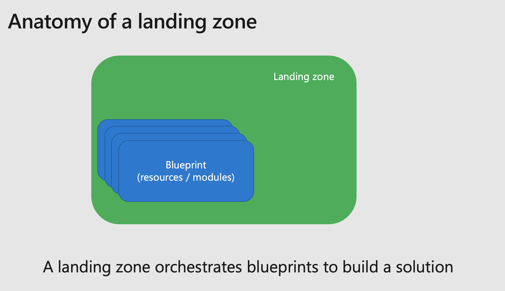
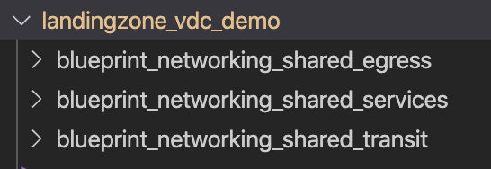
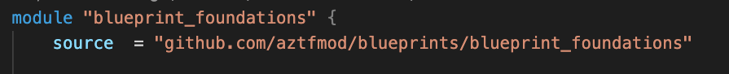

[](https://dev.azure.com/azure-terraform/5c5eb3a0-90ba-4109-967d-554526ddbbaf/_boards/board/t/0a51b0f0-73a7-4373-81d5-216c0602ea3b/Microsoft.EpicCategory)

# Introduction to Azure Cloud Adoption Framework landing zones for Terraform

Microsoft Cloud Adoption Framework for Azure provides you with guidance to adopt Azure. When deploying resources in a new environment, you can leverage landing zones and blueprints to accelerate your deployment. A landing zone is a set of infrastructure components that assembled together deploys a complete environment ready to host an application.

## Overview

A landing zone is a fully ready environment to host your application in the cloud. The set of CAF landing zones are aligned with Cloud Adoption Framework recommendations, and allow you to quickly scaffold a deployment with fundamentals of cloud management.

Examples of landing zones:

- Hub and spoke topology
- Lambda architecture with Databricks
- Mobile application development platform
- Citrix cloud
- SAP BusinessOne

### Available landing zones

Currently we provide you with the following landing zones:

| Name | Purpose |  
| ------- | ---------------- |
| landingzone_caf_foundations  | setup all the fundamentals for a subscription (logging, accounting, security.). You can find all details of the caf_foundation landing zone in its README.|
| landingzone_vdc_demo  | setup a demo environment of a hub-spoke topology including shared services, as well as various DMZ (ingress, egress, transit). You can find all details of the vdc_demo landing zone in its README.|

## Getting started

We recommend developing and deploying landing zones using Visual Studio Code, leveraging VS Code Development Containers allows a smooth transition from your dev machine to your the exection environement (the rover).

### Prerequisites
In order to start deploying your with CAF landing zones, you need the following components installed in your environment:

- Visual Studio Code
- Docker
- Git

You can deploy it easily on Windows and MacOS with the following software managers:

MacOS | Windows |  
------- | ----------------
```brew cask install visual-studio-code``` </br> ```brew install git docker ``` | Install Chocolatey (https://chocolatey.org/docs/installation) </br> ``` choco install git vscode docker-desktop ```

Once installed, open **Visual Studio Code** and install "**Remote Development**" extension as follow: 

### Cloning the repository
Cloning your first repository:
```bash
git clone https://github.com/aztfmod/landingzones.git 
```

### Open the repository in Visual Studio Code

Open the repository you've just cloned in Visual Studio Code, click on the lower bar, green sign and in the palette opening on the top of Visual Studio Code Window, select **"Open Workspace in container"**

This should take a while, in the meantime, feel free to click on Details to see the container being downloaded from the registry and being connected to yur local environment:

You will have to accept local mapping to your filesystem when Docker prompts you, so that you can access your files from your container.

After a while, your environment is ready, note on the lower left part of Visual Studio Code, that you are now in your Azure CAF rover, which is your environment to use Azure landing zones. 

### Deploying your first landing zone
You must be authenticated first:
For that we will rely on Azure authentication as completed by Azure Cli, via browser method:

```bash
rover login
```

You can then launch your first landing zone as follow:

```bash
rover landingzone_caf_foundations plan
```

```bash
rover landingzone_caf_foundations apply
```

```bash
rover landingzone_caf_foundations destroy
```

## Service composition
Landing zone is a fully environment ready to use, running on Microsoft Azure. From the software prospective, the landing zone is the element doing the service composition by calling different blueprints to deploy the complete environment as in the picture below: </br> 

By default, the blueprints are store locally in the landing zone, for instance, the hub_spoke landing zone which has a set a below: </br>
 </br>
A blueprint can also be used directly from the GitHub public blueprints: 

More to come soon on that!

Happy deployment with Azure landing zones, let us know your feedback and how you need it to evolve!

## Contribute

Pull requests are welcome to evolve the framework and integrate new features.
