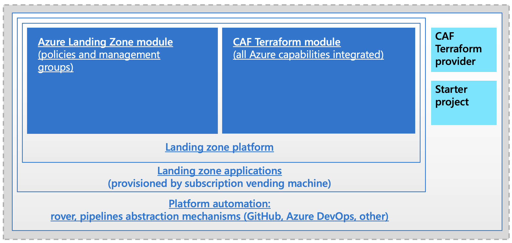

# Cloud Adoption Framework for Azure Terraform landing zones

Microsoft [Cloud Adoption Framework for Azure](https://docs.microsoft.com/azure/cloud-adoption-framework/overview) provides you with guidance and best practices to adopt Azure.

A landing zone is a segment of a cloud environment, that has been pre-provisioned through code, and is dedicated to the support of one or more workloads. Landing zones provide access to foundational tools and controls to establish a compliant place to innovate and build new workloads in the cloud, or to migrate existing workloads to the cloud. Landing zones use defined sets of cloud services and best practices to set you up for success.

We leverage Azure enterprise-scale landing zones and propose a Terraform-native structure, set of mechanisms and artifacts to get started to deploy workloads fast. 

You can review the different components parts of the Cloud Adoption Framework for Azure Terraform landing zones and look at the quick intro :vhs:  below:

## Goals

Cloud Adoption Framework for Azure Terraform landing zones is an Open Source project equiping the Site Reliability Engineer on Azure with:

* Enable the community with a set of reusable landing artifacts.
* Standardize deployments using battlefield-proven components.
* Accelerate the setup of complex environments on Azure.
* Implement Azure enterprise-scale design and approach with native Terraform and DevOps.
* Propose a prescriptive guidance on how to enable DevOps for infrastructure as code on Microsoft Azure.
* Foster a community of Azure *Terraformers* using a common set of practices and sharing best practices.

## :rocket: Getting started

When starting an enterprise deployment, we recommend you start creating a configuration repository where you craft the configuration files for your environments.

The best way to start is to clone the [starter repository](https://github.com/Azure/caf-terraform-landingzones-starter) and getting started with the configuration files, you can find a quick [onboarding video here](https://www.youtube.com/watch?v=M5BXm30IpdY)

## Documentation

The documentation on this repo is  on how to develop, deploy and operate with landing zones can be found in the reference section [here](./documentation/README.md)

## Repositories

In CAF Terraform landing zones, we use multiple projects in a modular way so you can leverage all of them or some of them depending on where you are in your DevOps and GitOps journey. The main repositories are listed below, feel free to evaluate, use them and contribute to them also!

| Repo                                                                                              | Description                                                |
|---------------------------------------------------------------------------------------------------|------------------------------------------------------------|
| [starter kit](https://github.com/azure/caf-terraform-landingzones-starter)                        | landing zones configuration repository                     |
| [caf-terraform-landingzones](https://github.com/azure/caf-terraform-landingzones) (You are here!) | landing zones repo with sample and core documentations     |
| [rover](https://github.com/aztfmod/rover)                                                         | devops toolset for operating landing zones                 |
| [azure_caf_provider](https://github.com/aztfmod/terraform-provider-azurecaf)                      | custom provider for naming conventions                     |
| [module](https://github.com/aztfmod/terraform-azurerm-caf)                                        | CAF universal module available in the Terraform registry   |

## Community

Feel free to open an issue for feature or bug, or to submit a PR.

In case you have any question, you can reach out to tf-landingzones at microsoft dot com.

You can also reach us on [Gitter](https://gitter.im/aztfmod/community?utm_source=badge&utm_medium=badge&utm_campaign=pr-badge)

## Contributing

This project welcomes contributions and suggestions.  Most contributions require you to agree to a
Contributor License Agreement (CLA) declaring that you have the right to, and actually do, grant us
the rights to use your contribution. For details, visit https://cla.opensource.microsoft.com.

When you submit a pull request, a CLA bot will automatically determine whether you need to provide
a CLA and decorate the PR appropriately (e.g., status check, comment). Simply follow the instructions
provided by the bot. You will only need to do this once across all repos using our CLA.

## Code of conduct

This project has adopted the [Microsoft Open Source Code of Conduct](https://opensource.microsoft.com/codeofconduct/).
For more information see the [Code of Conduct FAQ](https://opensource.microsoft.com/codeofconduct/faq/) or
contact [opencode@microsoft.com](mailto:opencode@microsoft.com) with any additional questions or comments.
