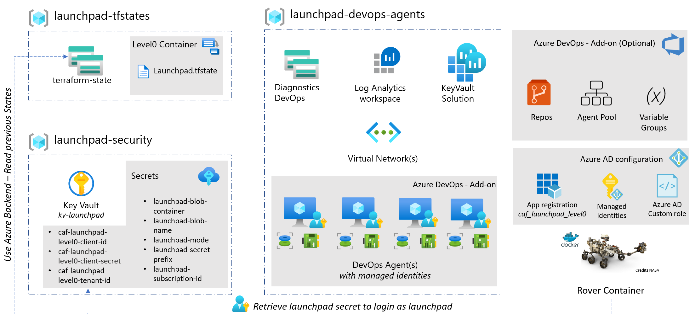

# Launchpad - scenario 200

The 200 scenario is an extension of the 100 scenario, meaning you can upgrade a 100 scenario to a 200.
The 200 scenario is designed to demonstrate a more secure environment but is not recommended for production use.
The focus of this scenario is to be able to deploy a more advanced launchpad from a remote machine and use the portal to review the settings in a non-constrained environment.
For example in this scenario you can go to the Key Vaults and view the secrets from the portal. A feature that is disabled in the 300+ scenarios. We recommend using the 200 scenario for demonstration or building new capabilities.

An estimated time of 20 minutes is required to deploy this scenario.

## Pre-requisites

This scenario require the following privileges:

| Component          | Privileges                     |
|--------------------|--------------------------------|
| Active Directory   | Application Administrator role |
| Azure subscription | Subscription owner             |

## Deployment

```bash
rover -lz /tf/caf/landingzones/caf_launchpad \
  -launchpad \
  -var-folder /tf/caf/landingzones/caf_launchpad/scenario/200 \
  -level level0 \
  -a apply

rover -lz /tf/caf/landingzones/caf_launchpad \
  -launchpad \
  -var-folder /tf/caf/landingzones/caf_launchpad/scenario/200 \
  -level level0 \
  -a destroy
```

## Architecture diagram



## Services deployed in this scenario

| Component                | Purpose                                                                                                                                                                                                                    |
|--------------------------|----------------------------------------------------------------------------------------------------------------------------------------------------------------------------------------------------------------------------|
| Resource group           | Multiple resource groups are created to isolate the services                                                                                                                                                               |
| Storage account          | A storage account for remote tfstate management is provided for each level of the framework. Additional storage accounts are created for diagnostic logs.                                                                  |
| Keyvault                 | The launchpad keyvault hosts all secrets required by the rover to access the remote states. The secret keyvault is used to host all Azure AD users, applications and virtual machines's ssh key.                           |
| Virtual network          | To secure the communication between the services a dedicated virtual network is deployed with a gateway subnet, bastion service, jumpbox and azure DevOps release agents. Service endpoints is enabled but not configured. |
| Bastion host service     | Is use to support the access to the rover in scenario 300 and 400.                                                                                                                                                         |
| Jumpbox                  | A Linux server with the docker engine to run the rover and perform the deployment of the scenario 300 and 400.                                                                                                             |
| Log analytics            | A central log analytics workspace is created to collect all diagnostics and metrics information. Solutions are also deployed.                                                                                              |
| Diagnostic profiles      | Default settings with 7 days retention of diagnostic profile is provided for all services.                                                                                                                                 |
| Diagnostic destination   | Operation sends the logs to a log analytics workspace and SIEM send all security logs to a storage account.                                                                                                                |
| Diagnostic               | Is enabled by default on all services.                                                                                                                                                                                     |
| Azure AD Users           | An Azure AD user is created. This user is used in scenario 300 and 400 to own the Azure DevOps Personal Access Token (PAT) rotation.                                                                                       |
| Azure AD Applications    | An Azure AD application is created. This account is mainly use to bootstrap the services during the initialization. It is also considered as a breakglass account for the launchpad landing zones.                         |
| Azure AD API permissions | A set of API permissions assigned to the Azure AD application to support management of the landing zones in a pipeline.                                                                                                    |
| Managed Identities       | A user managed Identity account is created for each Azure DevOps agent. This account is configured to get access to the keyvaults and Azure storage accounts                                                               |