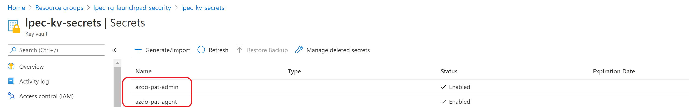

# Cloud Adoption Framework for Azure - Landing zones on Terraform - Azure Devops add-on

**:warning: This add-on is here for backward compatibility and will no longer be maintained. For new deployments, we recommend that you leverage the latest version available [azure_devops_v1](../azure_devops_v1)**

The Azure Devops add-ons allow you to setup you Azure Devops environment as a platform to automate all your subsequent landing zone deployment from level 0 until level 4 through Azure pipelines with self hosted agents.

* Azure Devops:
  - Agent Pools (Organization and Project Level)
  - Service Endpoint
  - Variables and Variable Groups
  - Pipelines

* Azure (Connection with Azure Devops):
  - Azure AD Application
  - Custom Role
  - Keyvault and access policies for Azure AD App

Azure Devops add-on landing zone operates at **level 0**

For a review of the hierarchy approach of Cloud Adoption Framework for Azure landing zones on Terraform, you can refer to [the following documentation](../../documentation/code_architecture/hierarchy.md).

## Dependencies

Landing zone:
* CAF Launchpad (Scenario 200 or above)

Azure Devops (example):
* Organization: https://dev.azure.com/azure-terraform
* Project     : contoso_demo (https://dev.azure.com/azure-terraform/contoso_demo)
* Repo        : caf-configuration (https://dev.azure.com/azure-terraform/contoso_demo/_git/caf-configuration)
  - In order for pipeline to work properly, YAML file should be in this repo and referred accordingly under pipeline section in azure_devops.tfvars
  - sample yaml attached [here](./scenario/200-contoso_demo/pipeline/rover.yaml).

Azure:
* PAT Token   : PAT Token should be updated in keyvault secret that deployed by launchpad LZ as below



## Deployment

```bash
rover -lz /tf/caf/caf_launchpad/add-ons/azure_devops \
  -tfstate azure_devops-contoso_demo.tfstate \
  -var-folder /tf/caf/caf_launchpad/add-ons/azure_devops/scenario/200-contoso_demo \
  -parallelism 30 \
  -level level0 \
  -env sandpit \
  -a apply


# If the tfstates are stored in a different subscription you need to execute the following command
rover -lz /tf/caf/caf_launchpad/add-ons/azure_devops \
  -tfstate_subscription_id <ID of the subscription> \
  -tfstate azure_devops-contoso_demo.tfstate \
  -var-folder /tf/caf/caf_launchpad/add-ons/azure_devops/scenario/200-contoso_demo \
  -parallelism 30 \
  -level level0 \
  -env sandpit \
  -a apply
```

We are planning to release more examples on how to deploy the Azure Devops Agents.
