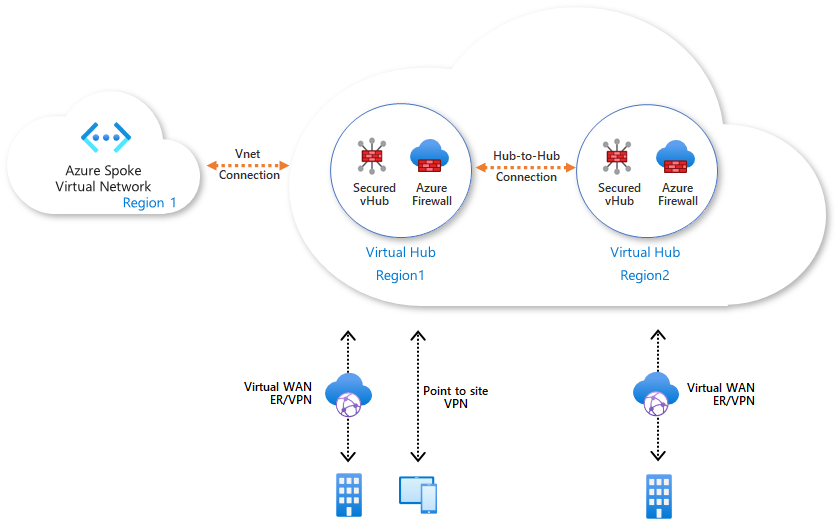

# CAF landing zones for Terraform - Azure Virtual WAN with Firewall manager

The networking landing zone allows you to deploy most networking topologies on Microsoft Azure. The same landing zone used with different parameters should allow you to deploy most network configurations.

* Hub and spoke
* Virtual WAN
* Application DMZ scenario
* Any custom network topology based on virtual networks or virtual WAN
* Library of network security groups definition

Networking landing zone operates at **level 2**.

For a review of the hierarchy approach of Cloud Adoption Framework for Azure landing zones on Terraform, you can refer to [the following documentation](../../../../documentation/code_architecture/hierarchy.md).

## Architecture diagram

This example allows you to deploy the following topology:




## Components deployed by this example

| Component                    | Type of resource                                      | Purpose                                                                                                                                                          |
|------------------------------|-------------------------------------------------------|------------------------------------------------------------------------------------------------------------------------------------------------------------------|
| vnet-spoke-re1, vnet-hub-re1 | Resource group                                        | resource group to host the virtual network and virtual WAN                                                                                                       |
| vnet_re1, vnet_re2           | Virtual network with subnets, network security groups | virtual network used as a spoke, attached to the virtual hub from Azure Virtual WAN                                                                              |
| contosovWAN-re1              | Virtual WAN                                           | virtual WAN infrastructure                                                                                                                                       |
| hub-re1, hub-re2             | Virtual Hubs                                          | virtual hubs to be deployed in region, the hubs can be configured to deploy point-to-site connectivity, site-to-site connectivity or Express Route connectivity. |
| hub_fw_re1, hub_fw_re2       | Azure Firewall                                        | traffic filtering between hubs and outside                                                                                                                       |
| hub_rg1-TO-vnet_rg1          | Virtual network and Virtual Hubs peering objects      | network peering between virtual hubs and virtual network                                                                                                         |


## Customizing this example

Please review the configuration files and make sure you are deploying in the expected region and with the expected settings.

## Deploying this example

Once you have picked a scenario for test, you can deploy it using:

```bash
rover -lz /tf/caf/caf_solution \
-level level2 \
-var-folder /tf/caf/caf_solution/scenario/networking/106-hub-virtual-wan-firewall \
-a apply
```
