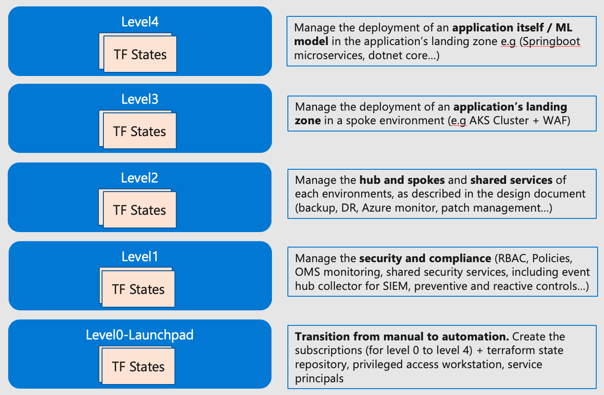
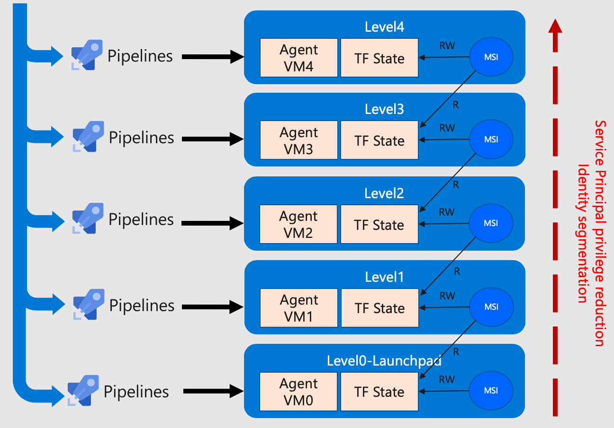

# Understanding landing zones hierarchy

Isolation of different Terraform state files is an important factor of reliability in an enterprise deployment.

## Layered approach

Separating the Terraform states enables:

- **Control blast radius**: if one configuration is deficient, its only impact the landing zone in scope and does not compromise the whole environment.
- **Enforce standard configuration**: by using different Terraform state, you can compose a complex environment very fast.
- **Enable autonomy**: different landing zones can enable innovation and features at different pace from each other.
- **Least privilege**: Each level is protected by its own identity to prevent unwanted modifications.

Cloud Adoption Framework for Azure proposes a hierarchy of landing zones based on 5 levels as described below:

### Level 0: Transition from manual to automation

Create the subscriptions (for levels 0 to level 4), creates the Terraform state repository for the different environments (sandpit, production, dev), created the privileged access workstation, and service principals.
Level 0 also enables the connection to the Azure DevOps environment as well as the creation of the DevOps private agents and the needed Azure AD groups for collaboration between the developers of the environment.

### Level 1: Core security, Governance and Accounting

Level 1 is responsible for RBAC enforcement on the subscriptions, subscription behavior configuration using Azure Management groups and Azure Policies ensures deployment of preventive and reactive controls.
This level is also in charge of deploying the fundamental configuration for Azure Monitor and Log analytics, shared security services, including Azure Event Hub namespace for integration with third parties SIEM solutions.

### Level 2: Shared services

Shared services include each environments the core networking components (using hub and spoke or any other network topology). Level 2 also includes services like Azure Site Recovery Vault for Backup and Disaster Recovery, Azure monitor settings for the monitoring of the environment alongside with Azure Automation for patch management of the resources.
Other resources could be image management for virtual machines in the environment.  

### Level 3: Application infrastructure

This layer is responsible for enforcing the application environment overall configuration for instance the Azure AppService environment, the Azure Kubernetes Services Cluster, the API Management services and all its dependency to deliver a service: deploying the Azure Application Gateway, Web Application Firewall.

### Level 4: Application layer

This level contains the application configuration and links to the source repository and frameworks. It describes which framework is used (for instance Springboot microservices, dotnet core, etc.) and described the configuration of the application (how many instances, how to link to the database, etc.).

## Operate with landing zones hierarchy

A deployment will typically contain little "level 0" landing zones, a few "level 1" and "2", couple of "level 3" and as many "level 4" as applications will exist in an environment.

It is important to keep in mind that each landing zone will be enforced by a pipeline as showing below:

For a given "level" in the environment, each Agent VM will be assigned a managed identity that will be used to authenticate and authorize operations on:
- The target Azure Subscription
- The Terraform state file: will be Read and Write permissions for the current level, will be Read only permissions for a "lower" level type of landing zone, avoiding alterations on more privileged environments.

In the example above, each pipeline will have its lifecycle management (typically, level 0 and 1 will be initiated at every new subscription creation, while level 4 could be initiated as many times a day you deploy code in your application environment).