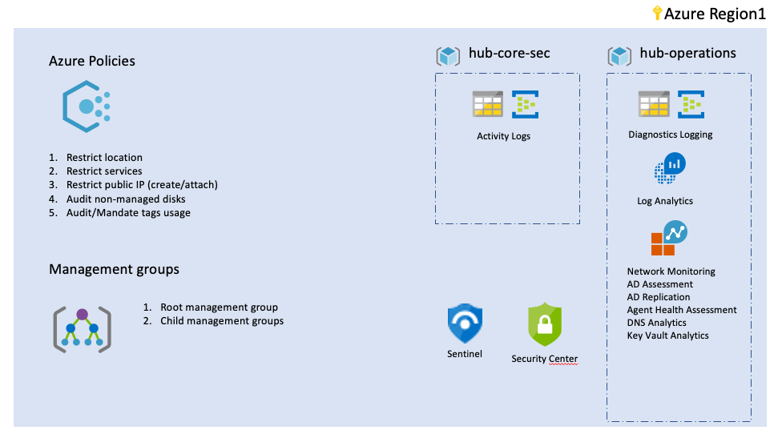

# How to create your first landing zone in 10 easy steps (part 1)

Coding a landing zone can be a bit intimidating, the white page syndrome can kick-in and you might feel there are too much things to do, so here is my process in creating a landing zone.

**Warning:** This document is about the process of creating the landing zone and is not about Terraform objects and syntax. If you need to get started with Terraform, please refer to the following great documents:

1. Azure Citadel: https://azurecitadel.com/automation/terraform-new/ 
2. Hashicorp Learning: https://learn.hashicorp.com/terraform?track=azure#azure 
3. Terraform on Azure documenation: https://docs.microsoft.com/en-us/azure/terraform/ 

## Step 1. Start with the diagram

First thing to know: what are you trying to achieve?

For this article, we are going to take a reference architecture that is published on the Azure Architecture Center, the [Network DMZ between Azure and an on-premises datacenter](https://docs.microsoft.com/en-gb/azure/architecture/reference-architectures/dmz/secure-vnet-dmz).

The  architecture looks like this overall:


## Step 2. Identify the non-functional requirements

Above are the functional requirements (what your customer wants, and what you think about first) you have to keep in mind all the non-functional requirements. In order to expedite this, I will rely on CAF foundations landing zones, which will set that automatically for me.

You can find the reference of this landing zone [here](../../landingzones/landingzone_caf_foundations/readme.md) and below is the diagram of the components we use:


## Step 3. Do the parts inventory

In the development of the landing zone, my next step is to do the inventory of components that I need. For this case, looking at the diagram, I will need:

- public ip
- site-to-site gateway
- route objects
- azure firewall
- virtual network
- nsg
- subnets
- internal load balancer
- VM
- resource groups
- Azure Bastion (as a replacement of the management subnet, maybe)

I can source those components from:

- From my private repo of components (on my GitHub repo, Azure DevOps, or any other git solution)
- From the [Terraform Registry](https://registry.terraform.io/modules/aztfmod)
- From a landing zone I previously developed
- Directly from the azurerm [Terraform provider](https://www.terraform.io/docs/providers/azurerm/index.html)

Then I build the following matrix:

| Component              | Source                                                                                               | Notes                                                                                         |
|------------------------|------------------------------------------------------------------------------------------------------|-----------------------------------------------------------------------------------------------|
| public ip              | [module](https://registry.terraform.io/modules/aztfmod/caf-public-ip/azurerm/1.0.0)                  | Standard CAF module                                                                           |
| site-to-site gateway   | [Landingzone](https://github.com/aztfmod/landingzones/tree/master/landingzones/landingzone_vdc_demo) | I might want to reuse the code I created in another landing zone.                             |
| route objects          | azurem provider                                                                                      | I dont seem to have a module ready to use, so will implement it from provider                 |
| azure firewall         | [module](https://registry.terraform.io/modules/aztfmod/caf-azure-firewall/azurerm/1.1.0)             | Standard CAF module                                                                           |
| virtual network        | [module](https://registry.terraform.io/modules/aztfmod/caf-virtual-network/azurerm/1.0.0)            | using this module allows me to setup Vnet, v-subnets, nsg and diasgnostics / network watcher. |
| nsg                    | [module](https://registry.terraform.io/modules/aztfmod/caf-virtual-network/azurerm/1.0.0)            | using this module allows me to setup Vnet, v-subnets, nsg and diasgnostics / network watcher. |
| subnets                | [module](https://registry.terraform.io/modules/aztfmod/caf-virtual-network/azurerm/1.0.0)            | using this module allows me to setup Vnet, v-subnets, nsg and diasgnostics / network watcher. |
| internal load balancer | azurem provider                                                                                      | no module in registry                                                                         |
| VM                     | azurem provider or [module](https://registry.terraform.io/modules/aztfmod/caf-vm/azurerm/0.1.0)      | not yet decided                                                                               |
| azure bastion          | [Landingzone](https://github.com/aztfmod/landingzones/tree/master/landingzones/landingzone_vdc_demo) | I might want to reuse the code I created in another landing zone.                             |
| resource groups        | azurem provider                                                                                      | elementary component                                                                          |

This list might not be exhaustive yet, but at least I know where to sort components for my first prototype.

### The decision factors

At first you might observe it's easier to use provider as it might handle more elementary objects, and you might find the modules a bit harder to integrate. This is expected. However, when you use a module, you usually leverage more consistency and more best-practices For instance in our scenario, using the azurerm provider, I would have to implement separately: virtual networks, NSG, subnets, and then the logging and analytics components, whereas when I'm leveraging the CAF module, I have all of that taken care of, as well as the logging and analytics, which are based on components that were set up in the caf_foundations landing zone.

## Step 4. Write your prototype

### Making it work once, then two, then many

My next logical step is to start Visual Studio Code and start my first implementation. If its the first time you are authoring a landing zone, you might want to be very iterative and make things work once, then refactor and optimize. The more code you will write, the better you will be and maybe less refactoring will be needed, but first lets start putting the components together.

After cloning the landingzones repo, since I will rely on "landingzone_caf_foundations", I can use the "landingzone_starter" as its a good model to start building on "landingzone_caf_foundations"
Let's open this landing zone and create our first files there:

1. prototype.tf: will contain my code, without much structure at first.
2. variables.tf: will contain my variables.
2. prototype.auto.tfvars: so that I interpolate my variables in a quick (and dirty) way.

Here is my first try:

```hcl
resource "azurerm_resource_group" "myresourcegroup" {
  name     = "caf-prototype-rg"
  location = "Southeastasia"

  tags = {
    environment = "Dev"
    country     = "Thailand"
  }
}

resource "azurerm_availability_set" "as1" {
  name                = "as1-web"
  location            = azurerm_resource_group.myresourcegroup.location
  resource_group_name = azurerm_resource_group.myresourcegroup.name

  tags = {
    environment = "Production"
  }
}

etc...
```

You can see that on this iteration, I'm not trying to be smart, I just want to make things work using the components I chose. I will use more variables in my next iteration, after I make the components works together.

Importantly at this stage I want to test:

1. The deployment is working as expected.
2. The life cycle is correct: I must be able to PLAN -> APPLY -> DESTROY. If any of those steps work, your code is not good enough and you must refactor.  

At the end of this stage, I should have most of my components as a flat file on my environment, allowing me to check the components are deploying correctly, as expected, I can now work on my first refactoring.

### Standardizing with the lower levels

Next step, I want to make sure I leverage the lower level landing zones (ie: caf_foundations sets for me a couple of very good components, so I will check how to use them) and also to more complex structure like modules for virtual network, and more variables:

```hcl
resource "azurerm_resource_group" "rg_network" {
  name     = "caf-prototype-rg"
  location = local.global_settings.location_map.region1
  tags     = local.global_settings.tags_hub
}

resource "azurerm_availability_set" "as1" {
  name                = "as1-web"
  location            = azurerm_resource_group.rg_network.location
  resource_group_name = azurerm_resource_group.rg_network.name
  tags                = local.global_settings.tags_hub
}

module "core_network" {
  source  = "aztfmod/caf-virtual-network/azurerm"
  version = "1.0.0"

  convention                        = local.global_settings.convention
  virtual_network_rg                = azurerm_resource_group.rg_network.name
  prefix                            = local.prefix
  location                          = local.global_settings.location_map.region1
  networking_object                 = var.shared_services_vnet
  tags                              = local.global_settings.tags_hub
  diagnostics_map                   = local.caf_foundations_accounting.diagnostics_map
  log_analytics_workspace           = local.caf_foundations_accounting.log_analytics_workspace
  diagnostics_settings              = var.shared_services_vnet.diagnostics
}
```

### Leveraging naming convention

I'm putting a little bit more CAF in the environment by using the [standard naming convention module](https://registry.terraform.io/modules/aztfmod/caf-naming/). This will allow names that I input into my environment to be formatted to the CAF recommended name convention. I will use here the "cafrandom" methodology which actually has been set in my caf_foundation landing zone. For that, I'm getting the value from: ```local.global_settings.convention``` I implemented it in the core_network module below, so the modules enforces it for me, but if I need to call it for my resource group, I would do it:

```hcl
module "caf_name_rg" {
  source  = "aztfmod/caf-naming/azurerm"
  version = "~> 0.1.0"
  
  name    = var.networking_object.rg.name
  type    = "rg"
  convention  = local.global_settings.convention
}

resource "azurerm_resource_group" "rg_network" {
  name     = module.caf_name_rg.rg
  location = local.global_settings.location_map.region1
  tags     = local.global_settings.tags_hub
}

```

We observed that many people stay at this stage, a very descriptive code, which is OK for one time usage, but is not very maintainable and not very DevOps friendly, so in the next step, we will move from something that works, to something that is usable in enterprise context.

## Step 5. Structure your code and variables

Now that we have more experience on the components, we can see the reuse patterns and can create variables that will make it handy to customize this landing zones, like the availability sets, load balancers, etc.

### The variables

At this stage, we will remove all hard-coded values and put in variables anything that must change.
One of the very good aspects of Terraform 0.12 type of syntax is that you can create quite complex objects to describe configuration variables. When you are creating those objects, you haves multiple ways aggregate objects them:

- Group by components: create a variable that describes your resource groups, your availability sets, etc. The advantage of this approach is that its easy to iterate on the modules with a ```for_each``` instruction:

```hcl
load_balancers = {
  lb1 = {
    ame = "ilb-web"
        frontend_name  = "PrivateIPAddress-ilb-web"
        tags = {  
            tier = "web"
        }
  }
  lb2 = {
    ame = "ilb-app"
        frontend_name  = "PrivateIPAddress-ilb-app"
        tags = {  
            tier = "app"
        }
  }
  lb3 = {
    ame = "ilb-db"
        frontend_name  = "PrivateIPAddress-ilb-db"
        tags = {  
            tier = "db"
        }
  }
}
````

- Group by services: thinking about personas that will be involved in managing the different objects and create functional objects: one to describe the web servers configuration, one to describe the application servers, and one to describe the database components.

```hcl
web_tier = {
    as = {
        name = "as1-web"
        tags = {  
            tier = "web"
        }
    }
    lb = {
        name = "ilb-web"
        frontend_name  = "PrivateIPAddress-ilb-web"
        tags = {  
            tier = "web"
        }
    }
}
```

For now, we don't know which one is better, I will take the second approach for this illustration.

### The code

Every time we suspect there is a bit of code we can reuse, we can create either a module. Most of time, you want those module to be developed and stored locally, and once you are more sure of the re-usability and the code quality, then you might want to generalize them in your repositories.

```hcl
resource "azurerm_resource_group" "rg_network" {
  name     = "${local.prefix}${var.resource_groups.CORE-NET.name}"
  location = local.global_settings.location_map.region1
  tags     = local.global_settings.tags_hub
}

resource "azurerm_availability_set" "as_web" {
  name                = var.web_tier.as.name
  location            = azurerm_resource_group.rg_network.location
  resource_group_name = azurerm_resource_group.rg_network.name
  tags                = merge(local.global_settings.tags_hub, var.web_tier.as.tags)
}

resource "azurerm_lb" "ilb_web" {
  name                = var.web_tier.lb.name
  location            = azurerm_resource_group.rg_network.location
  resource_group_name = azurerm_resource_group.rg_network.name
  tags                = merge(local.global_settings.tags_hub, var.web_tier.lb.tags)

  frontend_ip_configuration {
    name                 = var.web_tier.lb.frontend_name
    private_ip_address_allocation = "Dynamic"
    subnet_id = lookup(module.mynetwork.vnet_subnets, "Web_tier", null)
  }
}
```

My code is functional, but a bit flat, I will now regroup it's features and my criteria will be the reusability of the components: a core network plus a VPN transit together should be a common pattern - so lets put it together and try to have a local module. In the end I have a structure  like this:

```
landingzone_secure_vnet_dmz
├── net_core
│   ├── bastion
│   ├── ddos_protection
│   ├── vpn_gateway
│   ├── dashboards
├── app_tiers
├── virtual_machines
├── rbac
├── etc...
```

The ```net_core``` will become responsible for all things networking in this environment, it will take all input variables and will generate the output that I will re-inject in other blueprints (subfolders):

```hcl
module "net_core" {
    source = "./net_core"
  
    global_settings                     = local.global_settings
    prefix                              = local.prefix
    location                            = local.global_settings.location_map["region1"]
    caf_foundations_accounting          = local.caf_foundations_accounting
    core_networking                     = var.core_networking
    rg_network                          = var.rg_network
}
```

The state of the code is stored as a landingzone stored here: [landingzone_secure_vnet_dmz](../../landingzones/landingzone_secure_vnet_dmz/)

I will soon publish part two of this article, discussing:

- Review the landing zones boundaries
- Review your resource groups, RBAC model
- Integrate the testing
- etc.

Start crafting and let me know your feedbacks!

[Back to summary](../README.md)