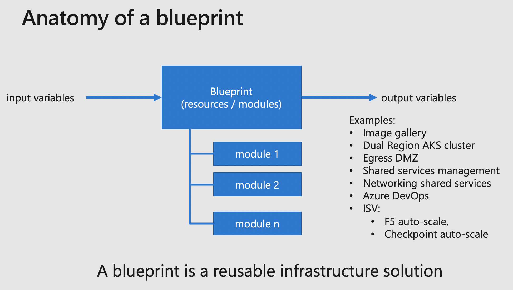

# Introduction to Azure landing zones components

Azure landing zones help you deploy a complete environment. The solution as published on this repository is composed of the following  components:

## DevOps Toolset

In order to bootstrap an environment, we provide the following minimal DevOps components tools.

### rover

[Source here](https://github.com/aztfmod/rover)

The "rover" is part of the fundamental tool set of the Azure Cloud Adoption Framework landing zones, it will allow you to deploy all the landing zones in a consistent and automated way.

+ It is Docker container running on all platforms transparently: Windows, Linux, Mac.
+ Allows validated **versioned** tool set
+ Helps you preserving stability across components versions
+ Helps you testing different versions of binaries (new version of Terraform, Azure CLI, etc.)
+ Facilitates the transition to CI/CD
+ Simplifies setup across DevOps teams: everyone works with the same versions of the tools
+ Integrates standard Cloud Adoption Framework and demo landing zones

### launchpad

[Source here](https://github.com/aztfmod/level0)

Launchpad acts as a your toolbox to deploy and manage the fundamentals of a deployment:

+ It will help you manage the Terraform states
+ Manage different environments (subscriptions, accounts, etc.)
+ Bootstraps the initial blueprints

In order to manage different subscriptions and environment, the launchpad can rely on **level0 blueprints**

A level0 blueprint is the foundation of account and subscription management, as such it is in charge of:

+ Defining how to store and retrieve the Terraform state
+ Defining the core of secrets protection for the Terraform state
+ Defining the management of the principals or identities for a complex environnement
+ Defining how to access/partition the different subscriptions

Currently we support an open source version of [level0 blueprints](https://github.com/aztfmod/level0). We are currently working on a [Terraform Cloud](https://www.terraform.io/docs/cloud/index.html) edition of level0 blueprint, feel free to join the corresponding working Channel on Teams.

## Modules

[Source here](https://github.com/aztfmod/)

Cloud Adoption Framework maintains a set of curated modules. We mainly use module to enforce a consistent set of configuration settings and requirements.

Modules must have a strong versioning, in the CAF modules, we use semantic versioning, and all modules are published on the [Hashicorp Terraform registry](https://registry.terraform.io/modules/aztfmod)

## Blueprints, or services

[Source here](https://github.com/aztfmod/blueprints)

A blueprint is a reusable set of infrastructure components put together to deliver a service. In its structure, it calls a set of modules, and may call directly resources in order to stich components together.

## Landing zone

[Source here](https://github.com/aztfmod/landginzones)

A landing zone is a composition of multiple blueprints and resources to deliver a full application environment.

The landing zone is **responsible** for the **Terraform state**, and will export outputs that may be reused by other landing zones.

The delivery of a full landing zone might be decomposed in multiples levels in other to manage different personas and contain the blast radius that a mistake could incur in one landing zone.

[Back to summary](../README.md)