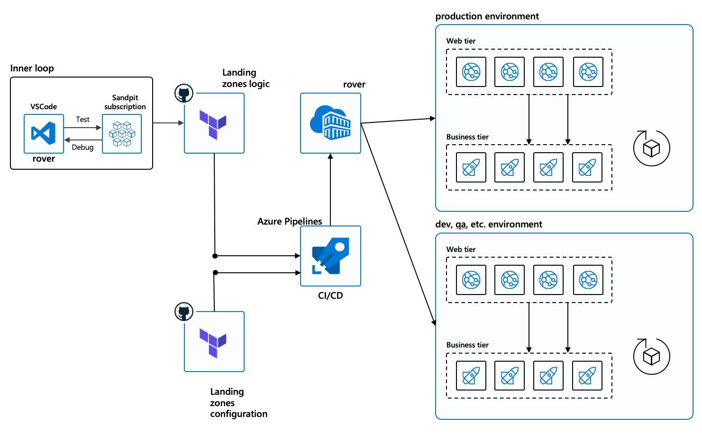
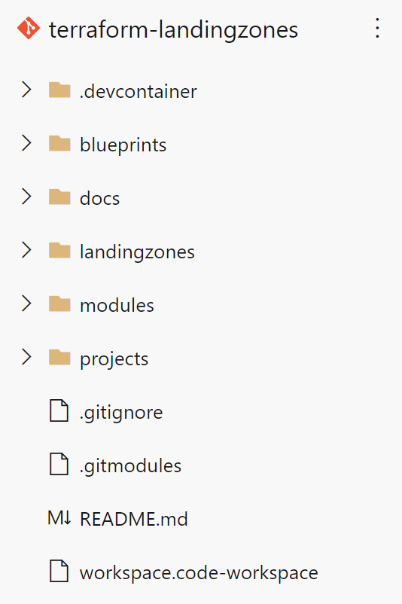
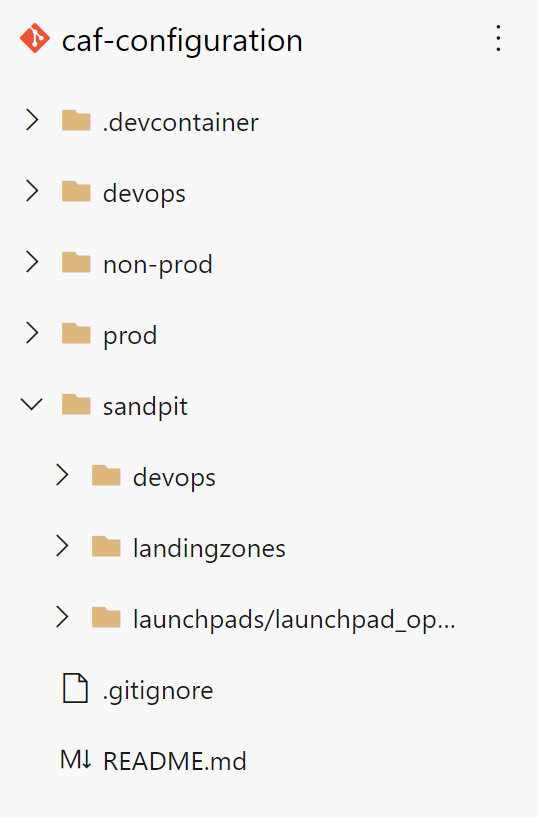

# Delivery model for landing zones

Cloud Adoption Framework for Azure landing zones for Terraform are to be delivered mainly by DevOps pipelines. The example below shows what could be an execution environment for DevOps using a combination of GitHub and Azure DevOps.

## DevOps components

The above model illustrates using both GitHub and Azure DevOps, but precisely because we are using the rover, it is relatively easy to pick your favorite enterprise toolset: Terraform Cloud/Enterprise, Jenkins, CircleCI, etc.

In greater detail we see the DevOps pipelines enforcing the landing
zones as below:

- **A inner feedback loop**:
Meant to provide very quick feedback to developers and DevOps engineers, offers the possibility to develop code, test it fast and iterate at fast pace.
- **DevOps pipelines enforcing the landing zones**:
A whole execution environment composed of pipelines executed in a customer environment.

- **Rover** is the DevOps toolchain that enables deployments as described [here](../code_architecture/intro_architecture.md).

We can distinguish two repositories for the environment:

- **Terraform scripts repositories**:  will be used to store and describe logic of Terraform deployments (the script and core code that will be executed)

- **Terraform configuration repositories**: will be used to store and describe the configuration of the environment and of the applications.
Different environments like PROD, DEV, UAT, etc. will be implemented using different configuration files inside the configuration repository.

The Azure pipelines will use Azure DevOps hosted agents to run the rover. We will be authenticated by Azure Active Directory with [Managed Identities](https://docs.microsoft.com/en-us/azure/active-directory/managed-identities-azure-resources/overview) of the DevOps self-hosted agents.

The deployment of the self-hosted DevOps agent is completed by the
launchpad\_opensource which will setup the agents and managed identities
as described in the previous chapter (landing zones hierarchy). One
Virtual Machine will be deployed per level and each Virtual Machine will
manage a few self-hosted agents depending on concurrent deployments
needs, in order to control privileges and reduce attack surface, we propose a hierarchy of pipelines that is described [here](../code_architecture/hierarchy.md).

## GitOps for Azure landing zones

Changes in the different environments introduced and promoted following GitOps concepts, principles and mechanisms:

- Configuration changes are described in a declarative language (here using Terraform).
- Operations are promoted from one environment to another via Git operations (Git commit, push, pull request).
- Changes are promoted only once they have reached quality gates (provided by automation, CI mechanisms and test suites executions) to promote higher quality changes.
- Changes are promoted only once they also have been validated by service owners in the environment (that can be declared in the DevOps configuration of the platform).

## Code and configuration repositories

GitOps leverages Git as a single source of truth for declarative
infrastructure and applications. Having a common code structure and
naming convention is critical to maintain code quality and enhance the
developer experience (especially for new team members).

When we deal with Infra as Code and landing zone deployments, we must
also make sure that the structure of our repository will support the
workflow of the different teams involved and enforce the segregation of
concerns with the multiple environments. *Should the code / variables be
organized by environments or by teams involved in the deployment
process*? Is a legitimate question. Code structure and organization is
always a hot topic, and while one size fits all is rarely the norm, we
tend to recommend starting with either of the following extending's on
Terraform (unclear) documentation.

For a given environment, ideally the code should remain identical and
only the variables should evolve. The following example illustrates the
two repository we recommend: one for the configuration and one for the code of deployment.

Looking closer at the configuration repository, we can see that each
environment is represented in a folder and each environment enforces the
following structure:

| **directory name** |  **purpose and content** |
| -------------------| ------------------------|
| devops             | Contains the DevOps environment variables to configure the Azure DevOps variable groups, and pipeline definitions |
| landingzones       | Contains a directory for each landing zone. Each directory will include its own pipeline definition for apply, destroy, etc.   Each directory must also contain the landing zones variable definitions files.
| launchpad          |  Contains the configuration files for the launchpad environment. |

An enterprise environment will consist of a series of pipelines
enforcing the different types of environments in different
subscriptions.

[Back to summary](../README.md)