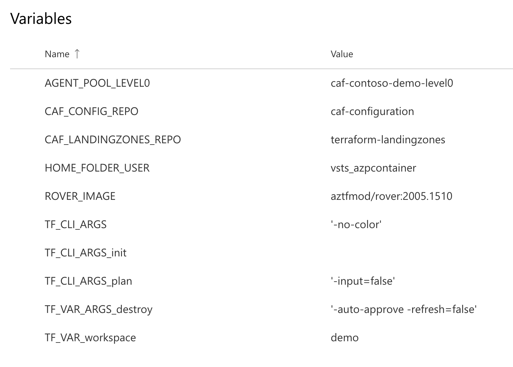
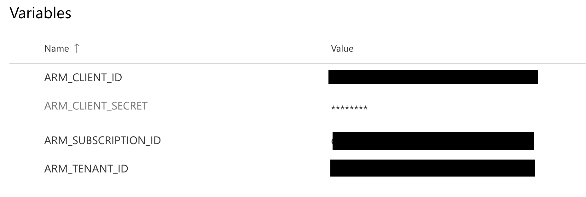
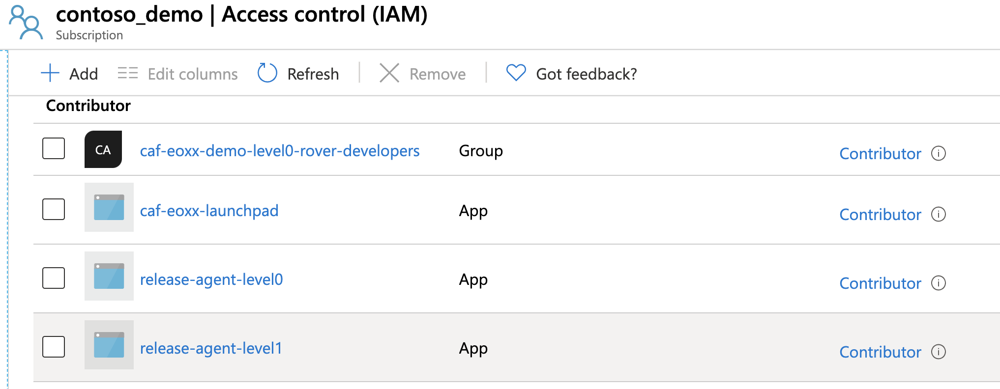
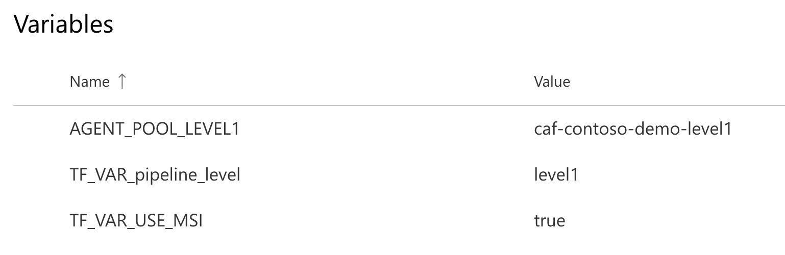

# Deploying landing zones with Azure DevOps

Starting in version 2005.xxxx, we introduced the support for the rover to run into GitHub Actions (GHA) and Azure DevOps, in this guide, you will find steps to deploy landing zones using rover.

## Introduction

Rover allows you to seamlessly run your landing zones in a team of developers and into Continuous Integration / Deployments environments, this decoupling of the versioning of the execution environnement with the CI/CD specifics allows versatility and if we tested only on GitHub Actions and Azure DevOps, it should be easy to deploy in other tools. We based this example of the [Azure DevOps YAML schema reference](https://docs.microsoft.com/en-us/azure/devops/pipelines/yaml-schema?view=azure-devops&tabs=schema%2Cparameter-schema).

In the examples below we will use service principals to authenticate to the Azure subscriptions, as well as [managed identities for Azure](https://docs.microsoft.com/en-us/azure/active-directory/managed-identities-azure-resources/overview)

## Getting started with Azure DevOps

In Azure DevOps, we will create a set of variable groups based on each needs of my pipelines, in this resource group, we will specify variables like the running environment options, the version of the rover we want to use, etc.

```yaml
name: "landingzone_test"

variables:
  group: demo-release-global

```

My variable group looks something like that:

We will then specify our resources as rover and its options to run in the pipeline:

```yml
resources:
  containers:
  - container: rover
    image: $(ROVER_IMAGE)
    options: --user 0:0 -e TF_PLUGIN_CACHE_DIR="/home/$(HOME_FOLDER_USER)/tf-plugin-cache" -e TF_DATA_DIR="/home/$(HOME_FOLDER_USER)"

  repositories:
  - repository: terraform-landingzones
    type: git
    name: terraform-landingzones

trigger: none
```

Since I don't want CI for this particular pipeline, I put an explicit ```trigger: none```

## Using Service Principal Authentication

First authentication method is simple: using service principals.

You first need to get a service principal and assign it to contributor role: you can follow the guide [here](https://docs.microsoft.com/en-us/azure/active-directory/develop/howto-create-service-principal-portal)

For this, we will store credentials in a variable group called ```release-level0-bootstrap```:


Then we call it using:

```yaml
jobs:
- job: launchpad
  displayName: "apply level0 launchpad"
  continueOnError: false

  container: rover

  variables:
  - group: release-level0-bootstrap

  steps:
  - checkout: self

  - bash: |
      az login --service-principal -u '$(ARM_CLIENT_ID)' -p '$(ARM_CLIENT_SECRET)' --tenant '$(ARM_TENANT_ID)'
      az account set -s $(ARM_SUBSCRIPTION_ID)

      export ARM_CLIENT_ID=$(ARM_CLIENT_ID)
      export ARM_CLIENT_SECRET=$(ARM_CLIENT_SECRET)
      export ARM_TENANT_ID=$(ARM_TENANT_ID)
      export ARM_SUBSCRIPTION_ID=$(ARM_SUBSCRIPTION_ID)

      /tf/rover/launchpad.sh /tf/launchpads/launchpad_opensource ${{ parameters.landingzone_action }} \
          -var-file ${BUILD_REPOSITORY_LOCALPATH}/$(TF_VAR_workspace)/launchpads/launchpad_opensource/launchpad.tfvars

    failOnStderr: true
    displayName: 'Terraform ${{ parameters.landingzone_action }}'

```

## Using managed identities for Azure

In this method, we do not store any form of credentials in the pipeline environment, we impersonate the Azure DevOps self-hosted agent's Azure identity for our Terraform operations.

For instructions on how to setup DevOps self-hosted agent for Azure DevOps, follow this [link](https://docs.microsoft.com/en-us/azure/devops/pipelines/agents/v2-linux?view=azure-devops)

This assumes that the managed identity for the DevOps agent has been added with appropriate permissions on your subscription.

In my example, we put the principal as a Contributor on our test subscription as follow:


We can then specify the variable group for authentication:


Then we run the pipeline using this self-hosted agent, specifying ```pool: $(AGENT_POOL_LEVEL1)``` as follow:

```YAML
jobs:
- job: landingzone_caf_foundations
  displayName: "apply caf foundations landingzone"
  continueOnError: false

  container: rover
  pool: $(AGENT_POOL_LEVEL1)

  variables:
  - group: demo-release-global
  - group: demo-release-level1

  steps:
  - checkout: self
  - checkout: terraform-landingzones

  - bash: |
      ls -lsa ${BUILD_REPOSITORY_LOCALPATH}

      sudo ln -s ${BUILD_REPOSITORY_LOCALPATH}/$(CAF_LANDINGZONES_REPO) /tf/caf
      sudo ln -s ${BUILD_REPOSITORY_LOCALPATH}/$(CAF_CONFIG_REPO) /tf/caf/tfvars

      az login --identity

      /tf/rover/rover.sh /tf/caf/landingzone_caf_foundations \
      apply \
      -w $(TF_VAR_workspace) \
      -tfstate "landingzone_caf_foundations" \
      -var-file /tf/caf/tfvars/$(TF_VAR_workspace)/landingzones/landingzone_caf_foundations/demo_landingzone_caf_foundations.tfvars

    failOnStderr: true
    displayName: 'Terraform apply'
```

In this example, we are checking out the repository and configuration inside the rover /tf/caf and /tf/caf/tfvars and then:
1. Authenticating using ```az login --identity```
2. Applying the landing zone using rover, stitching the code and variables for the specific pipeline.

## Conclusion

This is just a very quick example to show you how to leverage the various authentication options to run landing zones inside Azure DevOps. A lot can be improved and automated using the [Azure DevOps Terraform provider](https://github.com/microsoft/terraform-provider-azuredevops), we will follow-up on how to automate those steps in a future release and a future article.

[Back to summary](../README.md)