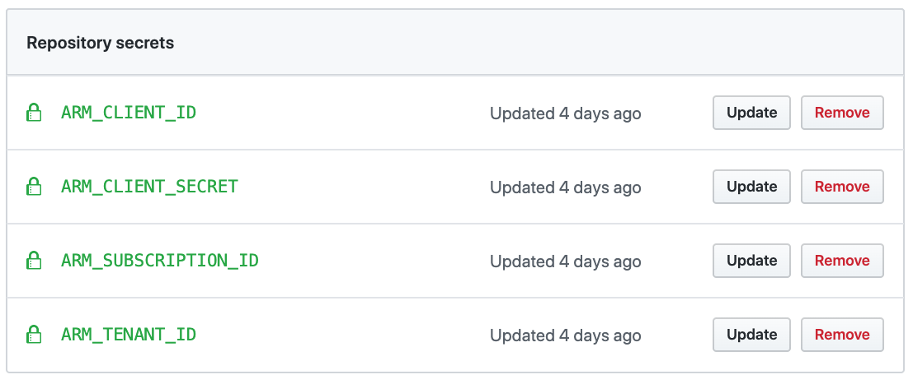

# Deploying landing zones with GitHub Actions

Starting in version 2005.xxxx, we introduced the support for the rover to run into GitHub Actions (GHA) and Azure DevOps, in this guide, you will find steps to deploy landing zones using rover.

## Introduction

Rover allows you to seamlessly run your landing zones in a team of developers and into Continuous Integration / Deployments environments, this decoupling of the versioning of the execution environnement with the CI/CD specifics allows versatility and if we tested only on GitHub Actions and Azure DevOps, it should be easy to deploy in other tools. We based this example of the [GitHub YAML workflow syntax](https://help.github.com/en/actions/reference/workflow-syntax-for-github-actions).

## Authentication in the pipelines

In the examples below we will use service principals to authenticate to the Azure subscriptions.

## Getting started with GitHub Actions

In GitHub Actions, you specify your pipelines configuration for your repo into the sub-folders ```/.github/worklows``` in our example, we specify it for pull requests validation as follow:

```yaml
name: landingzones

on:
  pull_request:
    branches:
      - master
```

We define the set of variables to get the authentication context and a couple of parameters, to automate destroy and specify the environment path for the variable path. The variables ```ARM_CLIENT_SECRET```, ```ARM_CLIENT_ID```, ```ARM_SUBSCRIPTION_ID```, and ```ARM_TENANT_ID``` all have been defined into my GitHub **Settings**, **Secrets**, as follow:



```yaml
env:
  TF_CLI_ARGS: '-no-color'
  TF_CLI_ARGS_destroy: '-auto-approve -refresh=false'
  ARM_CLIENT_SECRET: ${{ secrets.ARM_CLIENT_SECRET }}
  ARM_CLIENT_ID: ${{ secrets.ARM_CLIENT_ID }}
  ARM_SUBSCRIPTION_ID: ${{ secrets.ARM_SUBSCRIPTION_ID }}
  ARM_TENANT_ID: ${{ secrets.ARM_TENANT_ID }}
  TFVARS_PATH: '/tf/caf/environments'
```

### Launchpad deployment

We then specify a set of **jobs**: first one to deploy launchpad.

In the container strategy, notice we specify the container image to use the rover from Docker Hub, and we run as root using ```option: --user 0```

We configure the testing strategy using a matrix structure in order to be able to test multiple configurations during our tests, by default GitHub Actions will run them simultaneously but you can tune this behavior adding the ```max-parallel```

In the steps, note that we authenticate to Azure using the service principal, then select the right subscriptions. In the step ```Locate launchpad``` we first verify if there is a launchpad that might have been executed previously by locating the tags on the storage account, and if not, we deploy it.

```yaml
jobs:
  level0:
    name: level0
    runs-on: ubuntu-latest

    strategy:
      fail-fast: false
      matrix:
          region: ["westus2"]
          convention: ["random", "cafrandom"]

    container:
      image: aztfmod/rover:2005.1510
      options: --user 0

    steps:
      - name: Login azure
        run: |
          az login --service-principal -u '${{ env.ARM_CLIENT_ID }}' -p '${{ env.ARM_CLIENT_SECRET }}' --tenant '${{ env.ARM_TENANT_ID }}'
          az account set -s  ${{ env.ARM_SUBSCRIPTION_ID }}

          echo "local user: $(whoami)"

      - name: Locate launchpad
        run: |
         id=$(az storage account list --query "[?tags.tfstate=='level0' && tags.workspace=='level0']" -o json | jq -r .[0].id)
          if [ "${id}" == "null" ]; then
            /tf/rover/launchpad.sh /tf/launchpads/launchpad_opensource plan -var location=${{ matrix.region }}
            /tf/rover/launchpad.sh /tf/launchpads/launchpad_opensource apply -var location=${{ matrix.region }}
          fi

```

### CAF foundations deployment

Once the launchpad has completed, we then deploy the caf_foundations landing zone. This block is relatively simple, we specify we need ```level0``` to be deployed before running, then specify a matrix for testing conditions (this could be specified as simple variables in this case, but we leave room to grow). This landing zone will also use the ```caffoundationsci``` workspace.

```YAML
caf_foundations:
    name: caf_foundations
    runs-on: ubuntu-latest
    needs: level0

    strategy:
      fail-fast: false
      matrix:
          landingzone: ["landingzone_caf_foundations"]
          region: ["westus2"]
          convention: ["random"]
          environment: ["integration-tests"]

    container:
      image: aztfmod/rover:2005.1510
      options: --user 0

    steps:
      - uses: actions/checkout@v2

      - name:  setup context
        id: context
        run: |
          ln -s ${GITHUB_WORKSPACE} /tf/caf
          echo "ls /tf/caf" && ls -lsa /tf/caf
          ls -lsa /tmp

          workspace='caffoundationsci'
          echo ::set-env name=TF_VAR_workspace::${workspace}

      - name: Login azure
        run: |
          az login --service-principal -u '${{ env.ARM_CLIENT_ID }}' -p '${{ env.ARM_CLIENT_SECRET }}' --tenant '${{ env.ARM_TENANT_ID }}'
          az account set -s  ${{ env.ARM_SUBSCRIPTION_ID }}

          echo "local user: $(whoami)"

      - name: workspace
        run: |
          /tf/rover/launchpad.sh workspace create ${TF_VAR_workspace}

      - name: deploy caf_foundations
        run: |
            /tf/rover/rover.sh /tf/caf/${{ matrix.landingzone }} apply \
                '-var tags={testing-job-id="${{ github.run_id }}"}' \
                '-var-file ${{ env.TFVARS_PATH }}/${{ matrix.environment }}/${{ matrix.landingzone }}/${{ matrix.landingzone }}_${{ matrix.region }}_${{ matrix.convention }}.tfvars'
```

### Landing zones deployment

Once the fundamentals are set, we can now proceed to deploy the test landing zones in our environments. We are now making more use of the matrix structure to test all the landing zones simultaneously:

```yml
  landingzones:
    name: landingzones
    runs-on: ubuntu-latest

    needs: [level0, caf_foundations]

    strategy:
      fail-fast: false
      matrix:
          landingzone: ["landingzone_hub_spoke", "landingzone_secure_vnet_dmz", "landingzone_starter", "landingzone_vdc_demo"]
          region: ["westus2"]
          convention: ["cafrandom", "random"]
          environment: ["integration-tests"]

    container:
      image: aztfmod/rover:2005.1510
      options: --user 0

    steps:
      - uses: actions/checkout@v2

      - name:  setup context
        id: context
        run: |
          ln -s ${GITHUB_WORKSPACE} /tf/caf
          echo "ls /tf/caf" && ls -lsa /tf/caf
          ls -lsa /tmp

          job_id=${{ job.container.id }}
          workspace=${job_id:0:63}
          echo ::set-env name=TF_VAR_workspace::${workspace}

      - name: Login azure
        run: |
          az login --service-principal -u '${{ env.ARM_CLIENT_ID }}' -p '${{ env.ARM_CLIENT_SECRET }}' --tenant '${{ env.ARM_TENANT_ID }}'
          az account set -s  ${{ env.ARM_SUBSCRIPTION_ID }}

          echo "local user: $(whoami)"

      - name: workspace
        run: |
          /tf/rover/launchpad.sh workspace create ${TF_VAR_workspace}

      - name: deploy landing_zone
        run: |
          /tf/rover/rover.sh /tf/caf/${{ matrix.landingzone }} apply \
            '-var tags={testing-job-id="${{ github.run_id }}"}' \
            '-var-file ${{ env.TFVARS_PATH }}/${{ matrix.environment }}/${{ matrix.landingzone }}/${{ matrix.landingzone }}.tfvars' \
            '-var workspace=caffoundationsci'

      - name: destroy landing_zone
        if: always()
        run: |
          /tf/rover/rover.sh /tf/caf/${{ matrix.landingzone }} destroy \
            '-var tags={testing-job-id="${{ github.run_id }}"}' \
            '-var-file ${{ env.TFVARS_PATH }}/${{ matrix.environment }}/${{ matrix.landingzone }}/${{ matrix.landingzone }}.tfvars' \
            '-var workspace=caffoundationsci'

      - name: cleanup workspace
        if: always()
        run: |
          stg_name=$(az storage account list --query "[?tags.tfstate=='level0']" -o json | jq -r .[0].name)
          az storage container delete --account-name ${stg_name} --name ${TF_VAR_workspace} --auth-mode login

```

### Destroy and purges

In the rest of the scripts, we destroy the foundations and level0 landing zones and we also run a purge on the resource groups in the subscription in case there are any items remaining.

```yaml
level0_destroy:
    name: level0_destroy
    runs-on: ubuntu-latest

    needs: caf_foundations_destroy

    strategy:
      fail-fast: false
      matrix:
          region: ["westus2"]
          convention: ["random", "cafrandom"]

    container:
      image: aztfmod/rover:2005.1510
      options: --user 0

    steps:
      - name: Login azure
        run: |
          az login --service-principal -u '${{ env.ARM_CLIENT_ID }}' -p '${{ env.ARM_CLIENT_SECRET }}' --tenant '${{ env.ARM_TENANT_ID }}'
          az account set -s  ${{ env.ARM_SUBSCRIPTION_ID }}

          echo "local user: $(whoami)"

      - name: Remove launchpad
        run: |
            /tf/rover/launchpad.sh /tf/launchpads/launchpad_opensource destroy -var location=${{ matrix.region }} -auto-approve

      - name: Complete purge
        run: |
            for i in `az group list -o tsv --query '[].name'`; do az group delete -n $i -y --no-wait; done
            for i in `az monitor log-profiles list -o tsv --query '[].name'`; do az monitor log-profiles delete --name $i -y; done
```

## Conclusion

A lot can be improved in this script, but hopefully it gives you a good example on how to start with landing zones deployment in GitHub Actions!

[Back to summary](../README.md)