# Setting up identity bootstrap account

The purpose of the CAF Level 0 (L0) bootstrap Azure AD application is to own the creation of the launchpads. During that process a new Azure AD application is created with less permissions on the directory and also more specific Azure permissions to fulfill the Azure operations of the
level0 (subscription creation for example)

This document explains the manual process to create the L0 Azure AD app and the following information must be captured:

| Variable             | Item                     | Value |
| -------------------- | ------------------------ | ----  |
|ARM\_CLIENT\_ID       | Application (client) ID  |       |
|ARM\_CLIENT\_SECRET   | Client secret            |       |
|ARM\_TENANT\_ID       | Directory (tenant) ID    |       |
|ARM\_SUBSCRIPTION\_ID | Subscription ID          |       |

## Create Azure AD L0 App

Go to Azure Active Directory

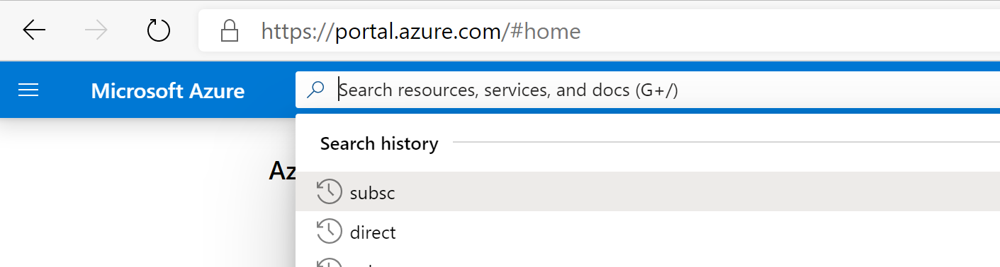

Create a **new** Azure **Active Directory Application**

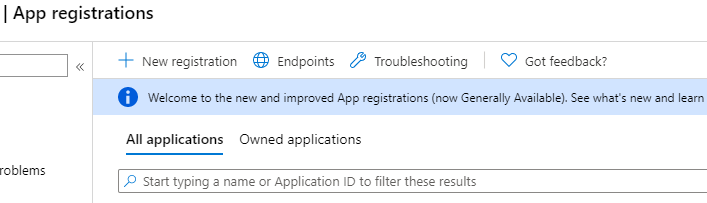

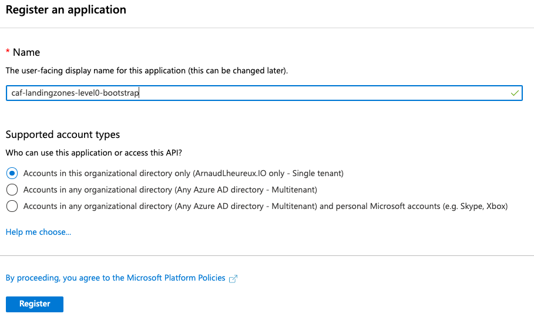

From the property pane select "**API permissions**"

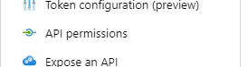

**Remove** the default one

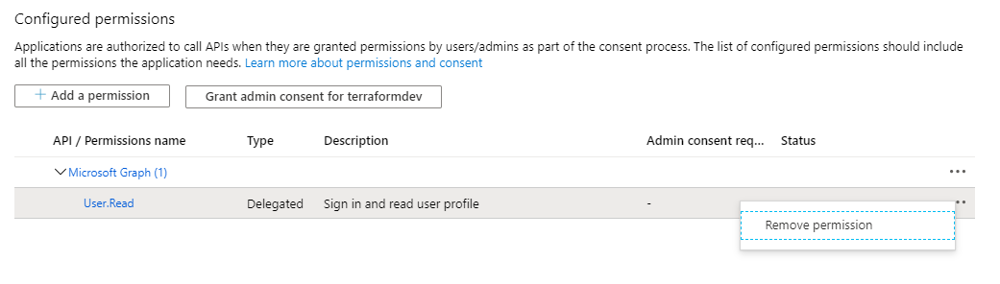

**Confirm the deletion**

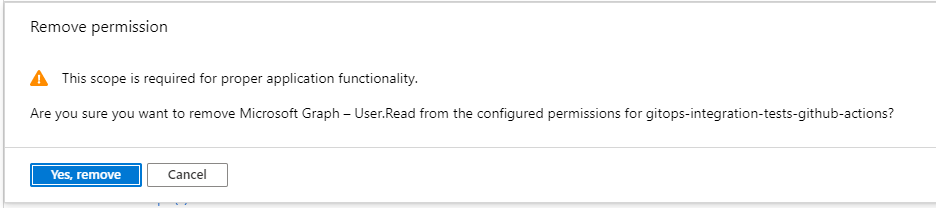

Click on "**Add a permission**"

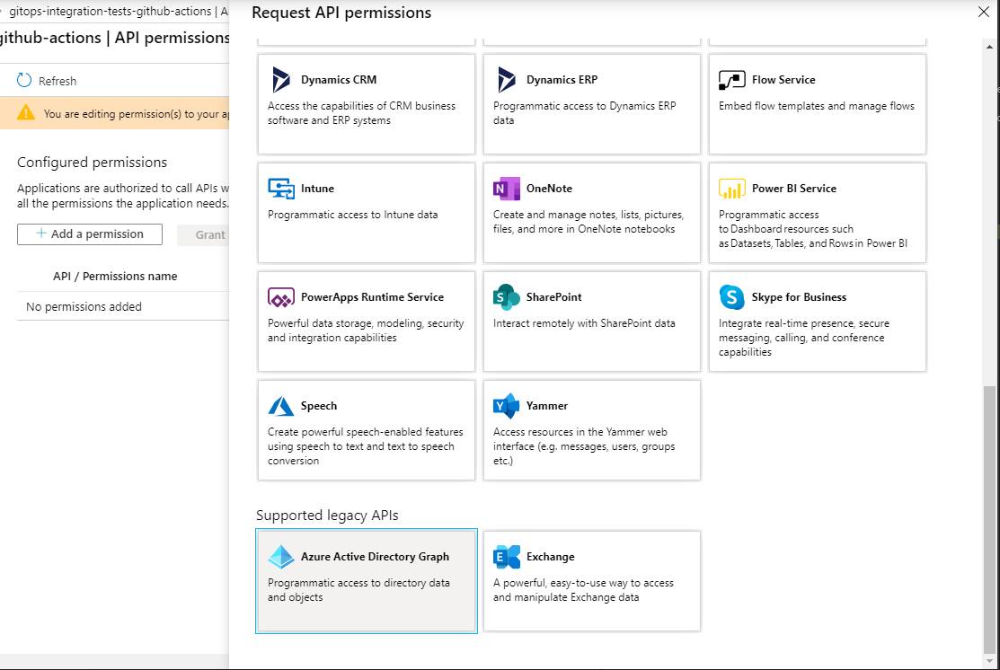

Select "**Application permissions**"

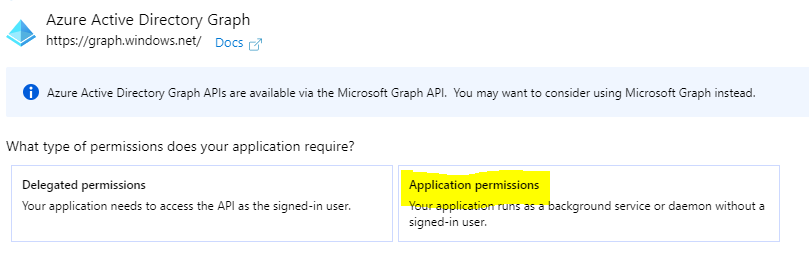

Select from "**Application**", "**Application.ReadWrite.OwnedBy**"

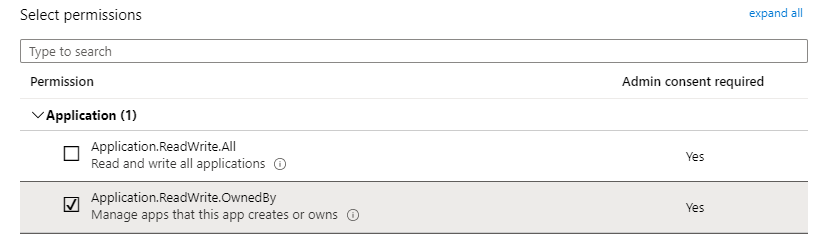

Then from "**Directory**" select "**Directory.ReadWrite.All**"

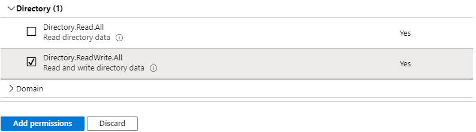

Complete the operation by pressing the blue button "**Add permissions**"

Click again on "*Add permission*"

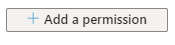

Select the "**Microsoft Graph**"

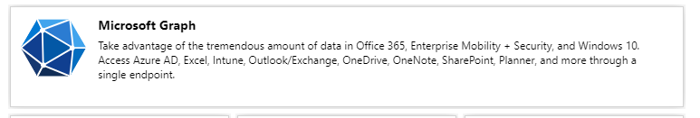

Select "**Application permissions**"

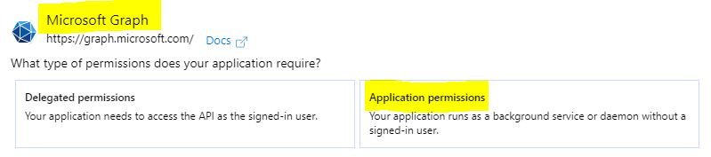

From "**AppRoleAssignment**" select "**AppRoleAssignment.ReadWrite.All**"

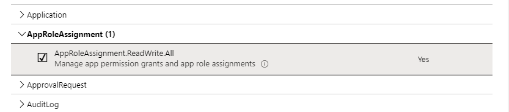

From "**DelegatedPermissionGrant**" select "**DelegatedPermissionGrant.ReadWrite.All**"

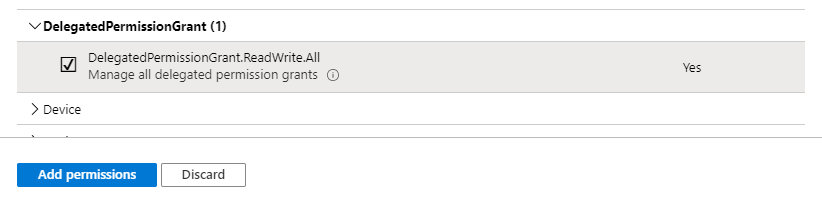

From "**Directory**" select "**Directory.ReadWrite.All**"

Complete the operation by clicking on the blue button "**Add permissions**"

You need to be logged-in with a user who has directory role "**Global Admin**" or permission to grant consents. When ready press the button "**Grant admin consent for \[name of your tenant\]**"

Confirm

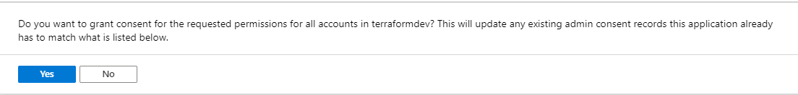

You can see the consents have been given with the green tick button

Now the Azure Active Directory Application has been created and given the right permission on the APIs, you need to set a complex password.

From the property pane select "**Certificates & secrets**"

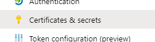

Click on "**New client secret**"

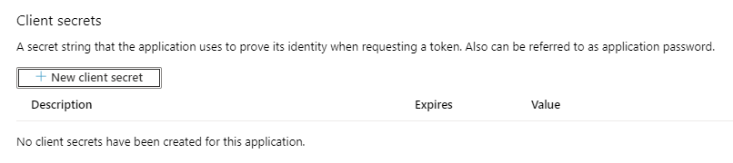

Put a description -- *date of the creation of the secret* as an example

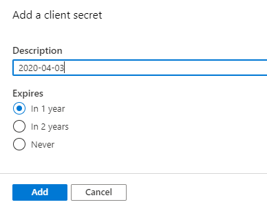

When ready click on the blue button "Add". Note the password will be displayed only after the creation. Copy the password as you will not be able to retrieve it again later. If you missed that step, delete the password and recreate a new one.

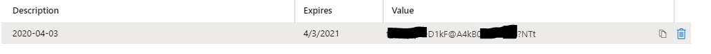

### Capture the tenant ID

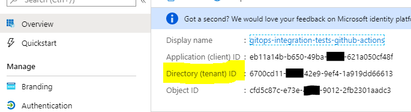

Capture the client ID

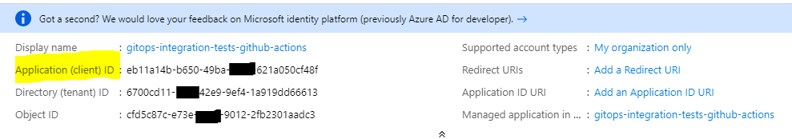

### Capture the subscription ID

From the Azure Portal search bar, type "**Subscription**"

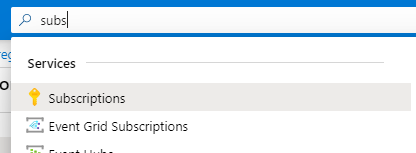

Capture the subscription ID

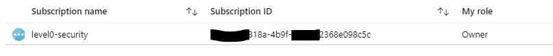

## Grant subscription owner to level0-security

Click on the subscription

Go to "**Access control (IAM)**"

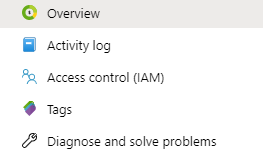

Select "**Add**".. "**Add role assignment**"

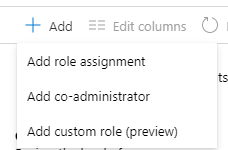

Select Role as "**Owner**". Set the Azure Active Directory application name you created earlier.

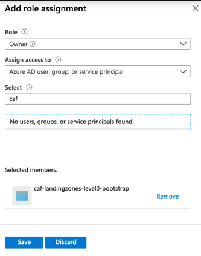

Click on the name and then on the "**save**" button

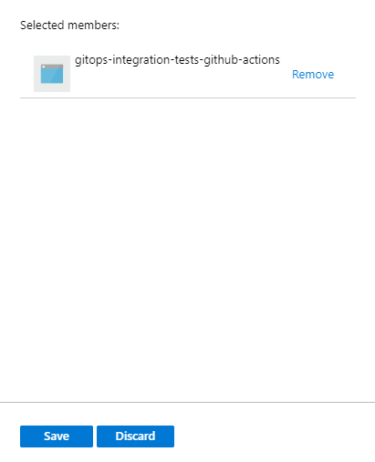

If all the steps have been completed successfully, you are ready to deploy the level 0 open source launchpad.