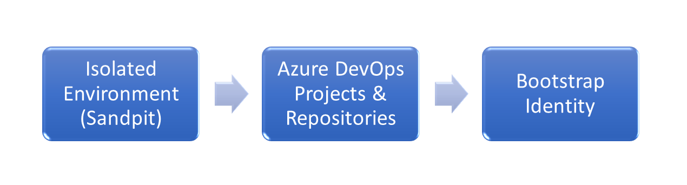
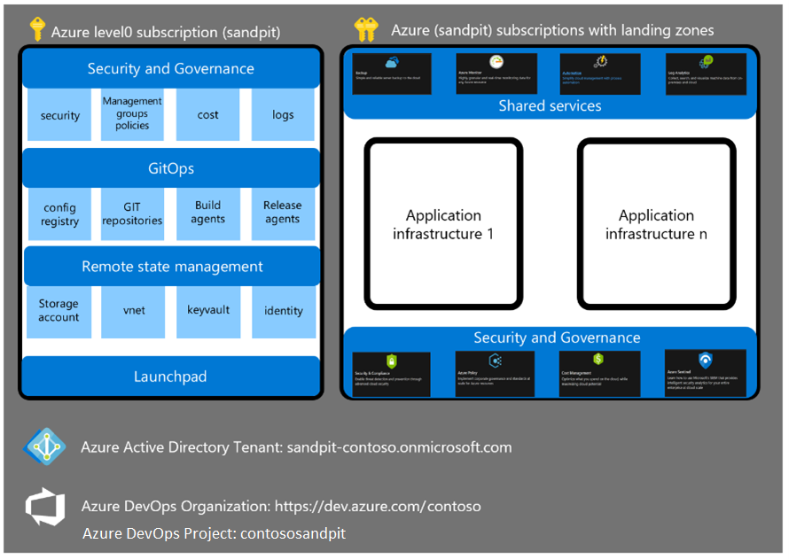
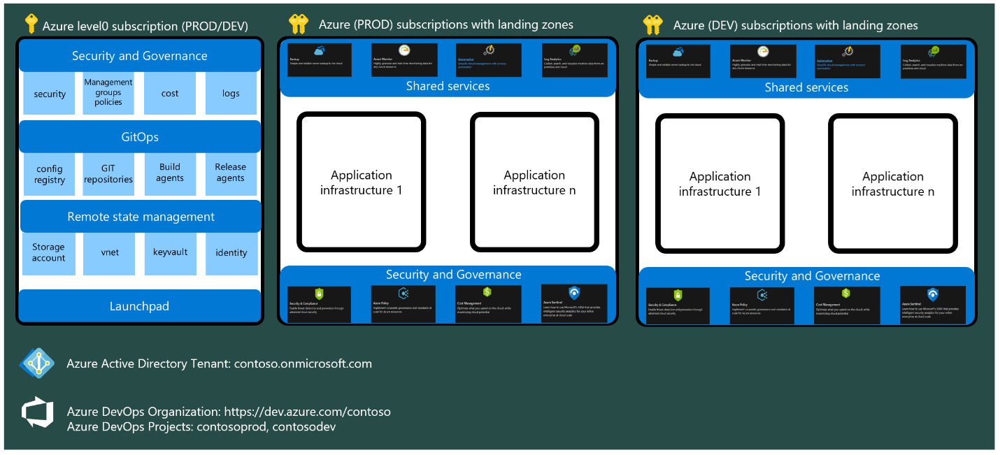
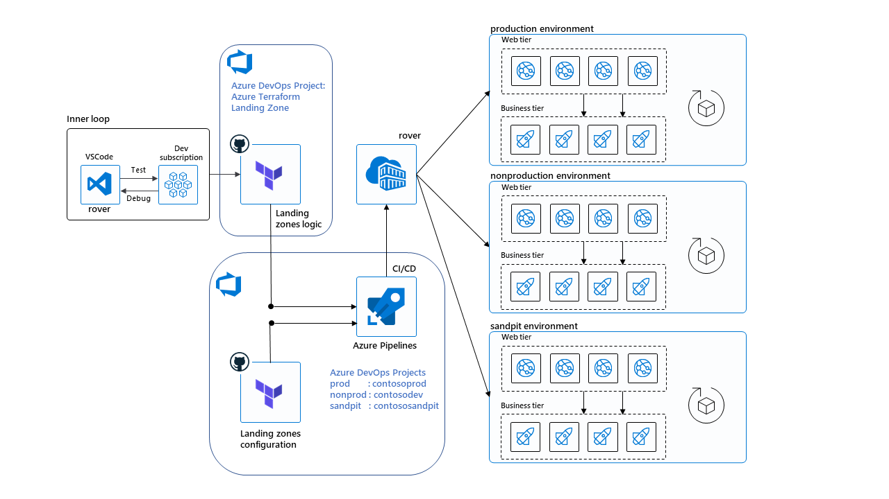

# Enterprise Adoption Guide on Cloud Adoption Framework for Azure - Landing zones on Terraform

## Overview

In this guide, we summarize steps to get started in an enteprise environment.


# Get Started (Step By Step)



## Azure Sandpit Environment

Successful implementations tend to focus on building first a sandpit/innovation hub environment where all stakeholders (IT operations, security, compliance, information protection, finance, and business) define their requirements.

The DevOps team focuses on building, automating, testing modules, and landing zones to create an infrastructure environment that is good enough.

We define a sandpit environment as an environment where innovation and experimentations can happen "freely".
As such is it composed of:
-	One or more subscriptions that are isolated from ANY customer environment.
-	A separate Azure AD tenant space.

## Azure DevOps

### Projects

Ideally multiple projects needed to fully utilize Azure landing zones capabilities:

* **Main Project** - Repository of your private Terraform code and project management for landing zones adoption in your organization
* **Configuration Projects** - For each environments (Production, Non-production, Sandpit) that you plan to leverage Azure Terraform landing zone, dedicated project in Azure Devops is needed to fully utilize the automation mechanism provided. This will reduce the risk and minimize error on mixing environments configuration files(.tfvars),pipelines and variables.

Examples Azure DevOps setup:

| Organization | Project | Purpose |
| ------------ | ------- | ------- |
| Contoso | Azure Terraform Landing Zone | Project Management of LZ and Repository for custom terraform code that specific to Contoso requirements |
| Contoso | contososandpit               | Repo to Store configuration file (tfvars), Pipeline, agent pool specific to sandpit                    |
| Contoso | contosodev                   | Repo to Store configuration file (tfvars), Pipeline, agent pool specific to nonprod                    |
| Contoso | contosoprod                  | Repo to Store configuration file (tfvars), Pipeline, agent pool specific to prod                       |

<br><br>

#### Sandpit IaC Configuration:



<br>

#### Prod & NonProd IaC Configuration:




### Repositories

During the lifecycle of the landing zones deployment you will probably find that it is easier to work first with a mono-repository environment but we recommend using multiple repositories as follow:
* **Configuration repository**: [this template can be used](https://github.com/azure/caf-terraform-landingzones-starter) as configuration repository for CAF landing zones, containing definition of the configuration for your different environments.
* **Logic repository**: this Azure CAF landing zone repository. Documentation to come on how to fork this repository.

This approach allows you to easily:
* check-in your configuration in your specific Git repository.
* resync the code with the public codebase for updates.
* customize the code if needed and contribute back to the community.

### Full IaC Architecture (Contoso example)



## Bootstrap process

### Bootstrap identity
In order to start consuming Azure Terraform landing zones, we need to create a privileged account to boostrap the environment.

You can opt for:
1. Using an user account with enough permission (Azure Active Directory Global Administrator)
2. Provision the identity bootstrap account with Azure AD application, you can refer to [the following documentation](./bootstrap_account_provisioning.md)

## Next steps

Once you done on those 3 important steps your organization is ready to adopt Azure Terraform Landing Zone. You can start by [following this documentation](../getting_started/getting_started.md) in order to setup your local development environment.

<br>

*if you are using Azure AD application for bootstrapping you might need to login with below command (with all the details from previous step [from following documentation](./bootstrap_account_provisioning.md)):

```bash
export ARM_CLIENT_ID=
export ARM_CLIENT_SECRET=
export ARM_TENANT_ID=
export ARM_SUBSCRIPTION_ID=

az login --service-principal -u ${ARM_CLIENT_ID} -p ${ARM_CLIENT_SECRET} --tenant ${ARM_TENANT_ID}
az account set --subscription ${ARM_SUBSCRIPTION_ID}
```

You are good to go. Start with launchpad and continue with higher level landing zones.
