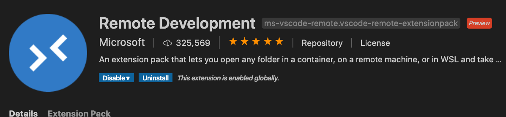
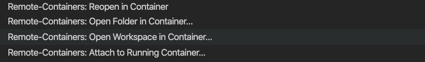
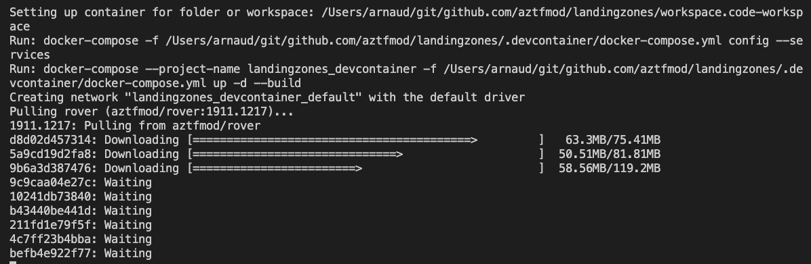
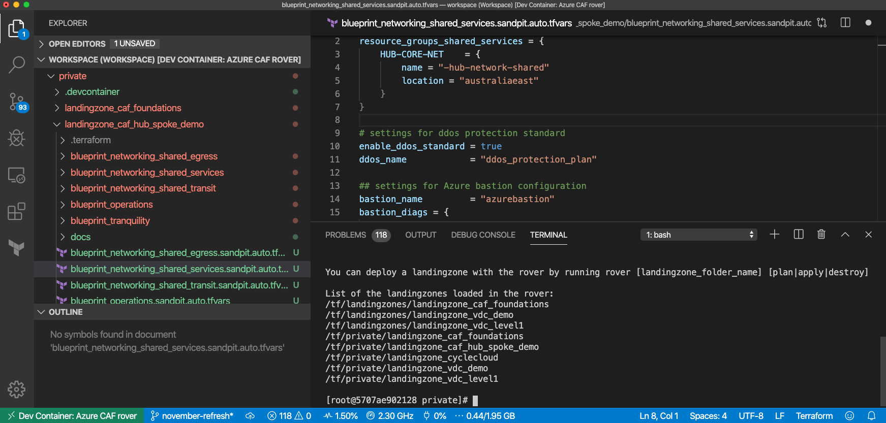

# Getting started with Azure Cloud Adoption Framework landing zones for Terraform

## Prerequisites

In order to start deploying your with CAF landing zones, you need an Azure subscription (Trial, MSDN, etc.) and you need to install the following components on your machine:

- [Visual Studio Code](https://code.visualstudio.com/)
- [Docker Desktop](https://docs.docker.com/docker-for-windows/install/)
- [Git](https://git-scm.com/downloads)

You can deploy it easily on Windows and MacOS with the following software managers:

| MacOS  | Windows |
| ------ | ------- |
|```brew cask install visual-studio-code docker``` </br> ```brew install git ``` | Install Chocolatey (https://chocolatey.org/docs/installation) </br> ``` choco install git vscode docker-desktop ``` |

Once installed, open **Visual Studio Code** and install "**Remote Development**" extension as follow: 

## Cloning the starter repository

The starter repository contains the basic configuration files and scenarios. It will allow you to compose your configuration files in the integrated environment.
Clone the repository using the following command:

```bash
git clone https://github.com/Azure/caf-terraform-landingzones-starter.git
```

## Open the repository in Visual Studio Code

Open the repository you've just cloned in Visual Studio Code, click on the lower bar, green sign and in the palette opening on the top of Visual Studio Code Window, select **"Open Folder in container"** or **"Reopen in container"**



This should take a while, in the meantime, feel free to click on Details to see the container being downloaded from the registry and being connected to yur local environment:



You will have to accept local mapping to your filesystem when Docker prompts you (here's [how you reconfigure Docker Desktop to allow fileshares](../../_pictures/caf_setup_docker_fileshares.png) ), so that you can access your files from your container.



After a while, your environment is ready, note on the lower left part of Visual Studio Code, that you are now in your Azure CAF rover, which is your environment to use Azure landing zones.

You must be authenticated first:
For that we will rely on Azure authentication as completed by Azure Cli, via browser method:

```bash
rover login
```

We recommend that you verify the output of the login and make sure the subscription selected by default is the one you want to work on. If not, you can use the following switch:

```bash
az account set --subscription <subscription_GUID>
```

## Enjoy the starter kit

Follow the instructions in the readme files of the starter repo to bring up different environments.

## Updating your development environment

If you are using previous version of Azure landing zones (v1.0.1912), since we migrated to use new version of the rover, which uses non-root containers, you will have to re-create your volumes.
You can achieve that running the following commands:

```bash
# To list all Dev Container volumes
docker volume ls -f label=caf

# To cleanup de Dev Container volumes make sure there is not running or stopped containers
docker ps
docker ps -a

# To cleanup a specific Dev Container
docker volume rm -f $(docker volume ls -f label=com.docker.compose.project=landingzones_devcontainer)

# To cleanup all Dev Containers
docker volume rm -f $(docker volume ls -f label=caf)
```

You can also purge Docker cache running the following command:

```bash
docker system prune -a
```

Happy deployment with Azure landing zones, let us know your feedback and how you need it to evolve!
