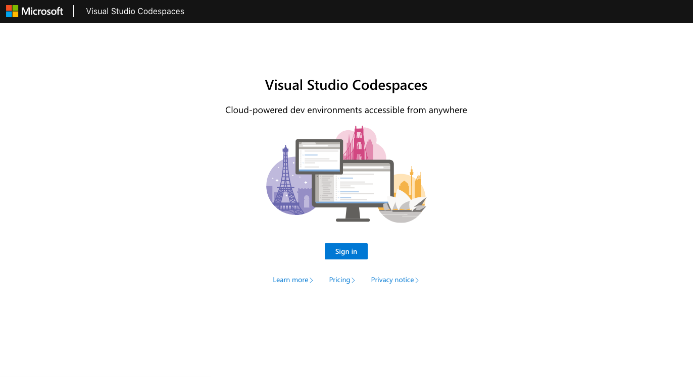
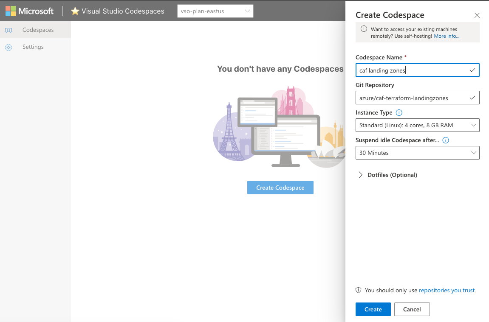
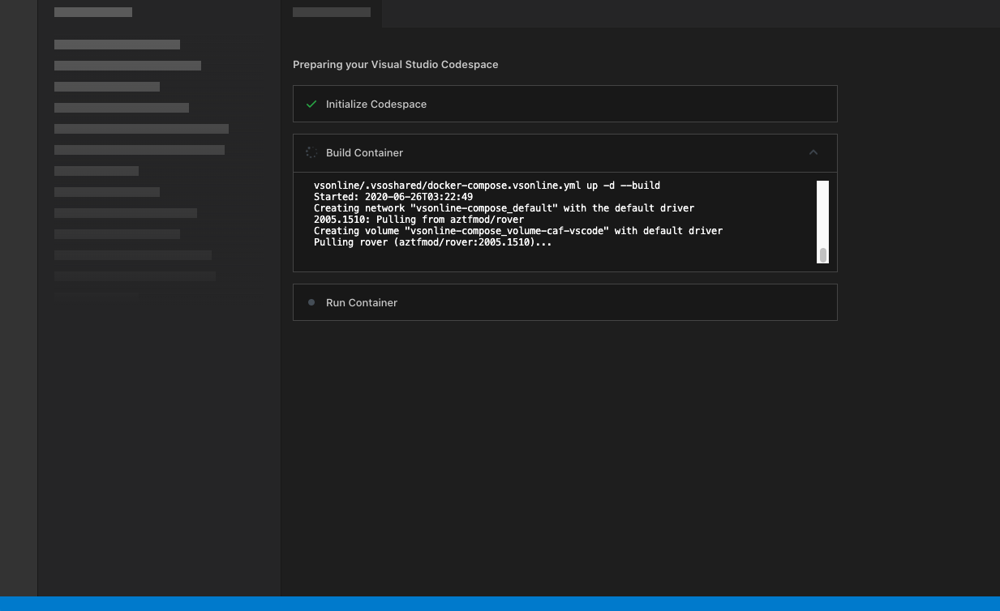
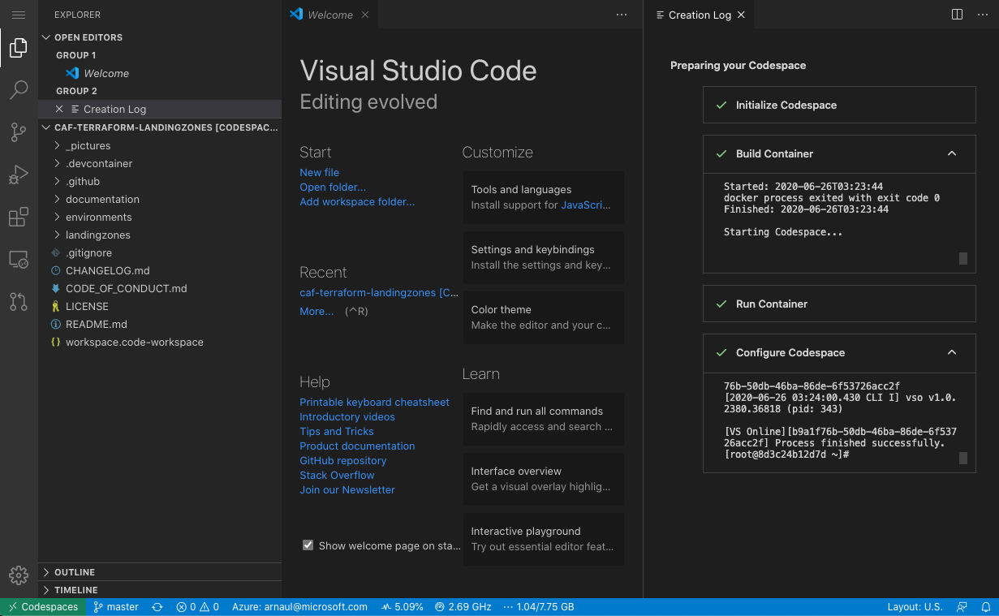
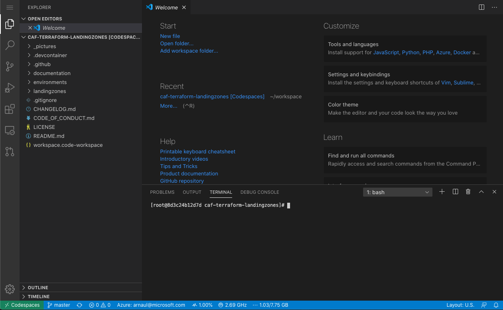
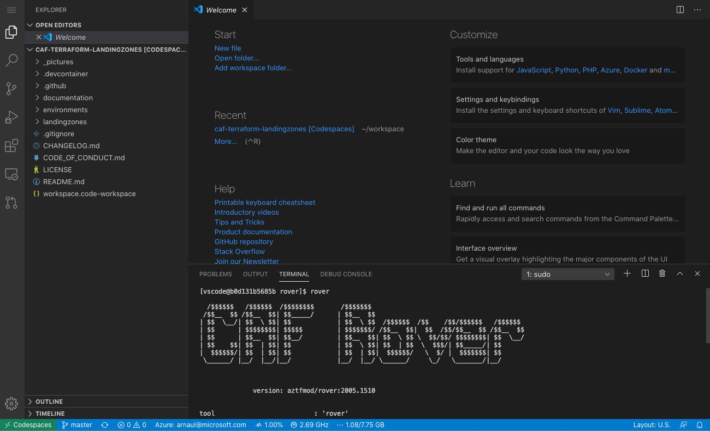

# Getting stated with Azure Cloud Adoption Framework landing zones on Visual Studio Codespaces

## Introduction

Visual Studio Codespaces is a browser-based editor with support for Git repos, extensions, and a built-in command line interface so you can edit, run, and debug your applications from any device. For more details on Visual Studio Codespace, you can visit the product page [here](https://visualstudio.microsoft.com/services/visual-studio-codespaces/)

## Prerequisites

In order to start deploying your with CAF landing zones on VS Codespaces, you need:

* an Azure subscription (Trial, MSDN, etc.)

## Create your account

Let's authenticate first:
[https://aka.ms/vso-login](https://aka.ms/vso-login)


## Create the repository in Visual Studio Code

Create the landing zones Codespaces clicking here: [](https://online.visualstudio.com/environments/new?name=caf%20landing%20zones&repo=azure/caf-terraform-landingzones)



The create process will look something like that:



Once ready, you should have your Visual Studio Interface as follow:


Open a Terminal using ```CTRL``` + ```J``` or ```Command``` + ```J```



You are ready to use landing zones by launching the rover as below:

```bash
rover
```



## Deploying your first landing zone

You must be authenticated first:
For that we will rely on Azure authentication as completed by Azure Cli, via browser method:

```bash
rover login
```

We recommend that you verify the output of the login and make sure the subscription selected by default is the one you want to work on. If not, you can use the following switch:

```bash
az account set --subscription <subscription_GUID>
```


## Deploying the DevOps requirements

On the first run, you need to use the launchpad to create the foundations for Terraform environment. This will set storage accounts to store the state files, and key vaults to get you started with a secure environment. It can eventually be upgraded to support your DevOps environment (pipelines, etc.)

You can find more information on the launchpad settings [Here](../../landingzones/caf_launchpad)

```bash
rover -launchpad -lz /tf/caf/landingzones/caf_launchpad \
-var-folder /tf/caf/landingzones/caf_launchpad/scenario/100 \
-a apply
```

## Deploying the foundations

Next step is to deploy the foundations (this typically could include management groups, policies, etc.). We can start with it empty, and enrich it later.

You can find more information on the launchpad settings [Here](../../landingzones/caf_launchpad)


Get started with the basic foundations:

```bash
rover -lz /tf/caf/landingzones/caf_foundations \
-level level1 \
-a apply
```

## Deploying a networking scenario

You can deploy one of the typical Azure network topologies (hub, hub and spoke, Virtual WAN).

Have a look at the example scenario [Here](../../landingzones/caf_networking) and pick one you want to deploy.

You can deploy a simple hub networking using:

```bash
rover -lz /tf/caf/landingzones/caf_networking \
-level level2 \
-var-folder /tf/caf/landingzones/caf_networking/scenario/100-single-region-hub \
-a apply
```

## Destroying your test

Once you are done testing, just use the same commands as before, juste replace the last line ```-a apply``` by ```-a destroy```.
