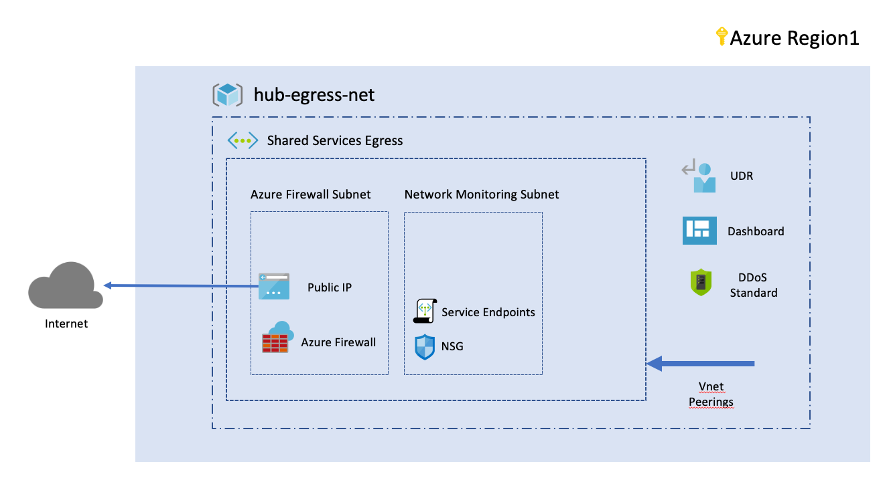

# blueprint_networking_shared_egress

blueprint_networking_shared_egress implements Azure Firewall to manage egress from a hub and spoke topology.  

## Overall architecture

The following diagram shows the environment we are deploying in this blueprint:

## Capabilities

The following components are managed by this blueprint
 - Virtual network
    - Virtual network address space
    - DNS Servers
    - Subnets
        - Subnet address space
        - Network Security Groups
        - Virtual Network Service Endpoints
        - NSG diagnostics
    - Attach NSG to subnet
    - Virtual network operations logs and auditing
- Virtual network peering object with shared_networking virtual network
- Azure Firewall
    - Set of sample rules for Azure Firewall
        - FQDN filtering rule
        - Tags filtering rule
- Public IP adress 
- Route object (UDR) ready to use (in this release, we don't actually stich the route object to any vnet, feel free to implement it.)

# Contribute

This is a demo environnement but pull requests are welcome to evolve the framework and integrate new features!