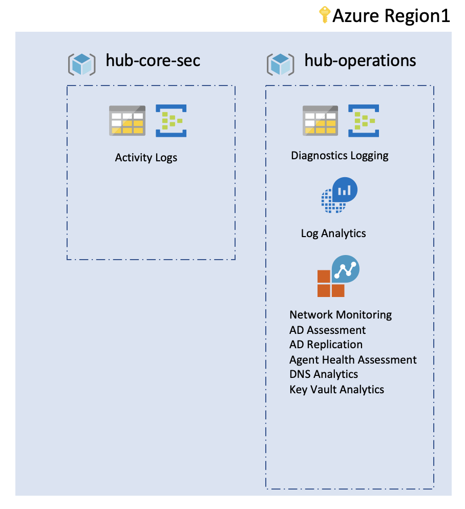

# foundations accounting

foundations sets the basics of auditing, and logging as described below.

## Capabilities

Foundations deploys the following components:

 - Resource groups
    - Core resource groups for foundation resources
 - Activity Logging
    - Auditing all subscription activities and archiving
        - Storage Account
        - Event Hubs (optional)
 - Diagnostics Logging
    - All operations logs kept for x days
        - Storage Account
        - Event Hubs
 - Log Analytics
    - Stores all the operations logs
    - Solutions management

## Customization

Customization happens at the landing zone using the variables.

## Contribute

Pull requests are welcome to evolve the framework and integrate new features.
