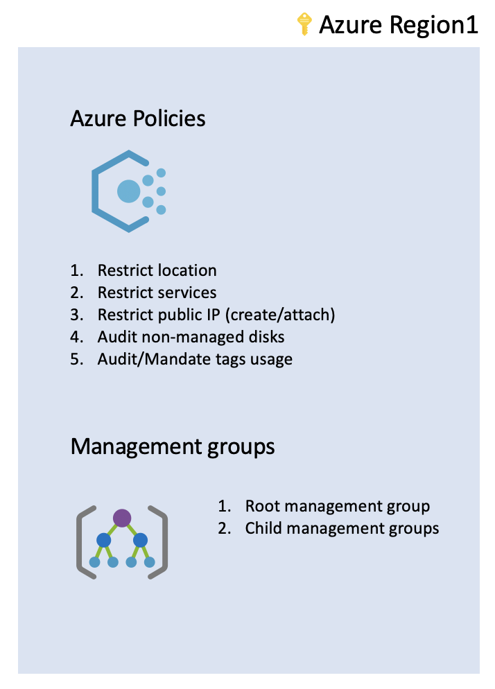

# foundations governance

foundations sets the basics of auditing, and logging as described below.

## Capabilities

Foundations deploys the following components:

 - Management groups
    - Creates a basic structure of management groups to support the subscriptions
 - Azure Policies
    - Defines a set of custom or built-in policies

## Customization

Customization happens at the landing zone using the variables.

## Contribute

Pull requests are welcome to evolve the framework and integrate new features.
