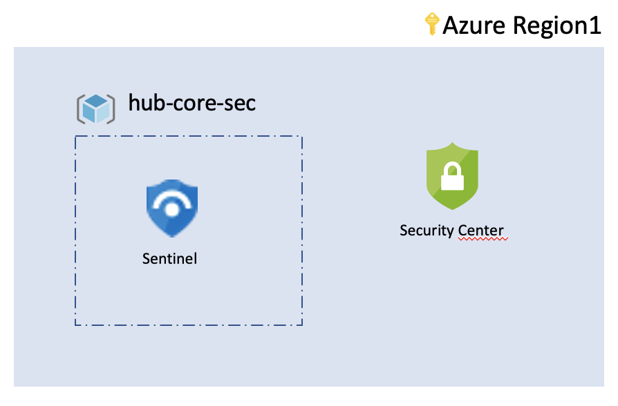

# foundations security

The foundations security is part of the foundations which help you setting the minimal controls for a subscription/deployment.

## Capabilities

Foundations security deploys the following components:

- Azure Sentinel
- Azure Security Center
    - Security hygiene metrics and alerts

## Customization

Customization happens at the landing zone using the variables.

## Contribute

Pull requests are welcome to evolve the framework and integrate new features.
