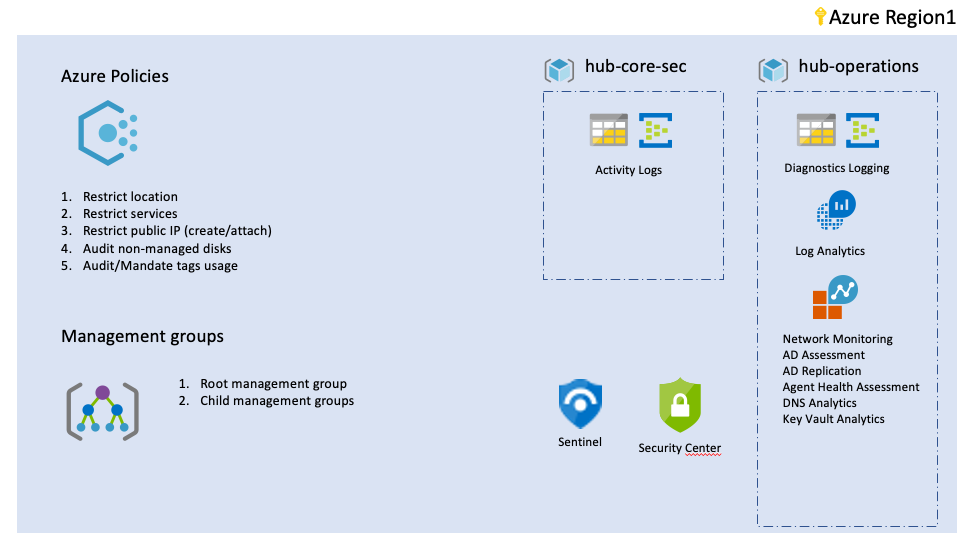

# Azure Cloud Adoption Framework Foundations

Welcome to Azure Terraform foundation landing zone: caf_foundations
The foundation landing zone sets the basics of operations, accounting and auditing and security for a subscription.

## Foundations architecture diagram



For an explanation on the purposes of the components in this foundational landing zone, please have a look at this specific Cloud Adoption Framework documentation: [Use Terraform to build your landing zones](https://docs.microsoft.com/en-us/azure/cloud-adoption-framework/ready/landing-zone/terraform-landing-zone).

## Getting Started

To deploy a landingzone, refer to the setup instructions here: https://github.com/aztfmod/landingzones

Deploy your first landingzone (caf_foundations)

```bash
rover -lz /tf/caf/landingzones/landingzone_caf_foundations -a plan
```

Review the configuration and if you are ok with it, deploy it by running:

```bash
rover -lz /tf/caf/landingzones/landingzone_caf_foundations -a apply
```

Have fun playing with the landing zone an once you are done, you can simply delete the deployment using:

```bash
rover -lz /tf/caf/landingzones/landingzone_caf_foundations -a destroy
```

The foundations will remain on your subscription so next run, you can jump to step 6 directly.
More details about the landing zone can be found in the landing zone folder ./landingzone_caf_foundations

## Update

We recommend you do not update an existing environment directly and should validate a new landing zone release in a separate environment.

## Contribute

Pull requests are welcome to evolve the framework and integrate new features.
