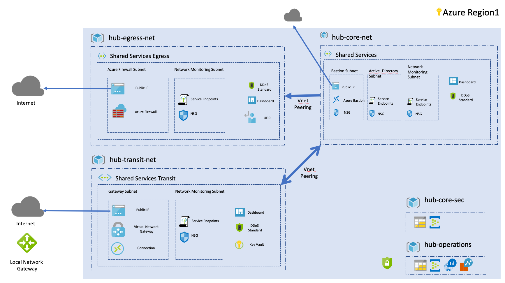

# Introduction to hub and spoke demo landing zone

Welcome to Azure Terraform hub and spoke topology architecture demo.

This landing zone demo is a simplified hub and spoke architecture for you to use in demo/POC.

**This landing zone does not represent Microsoft best practices for hub and spoke topology and is here to illustrate service composition and components reuse within a landing zone.**

The choice of multiple blueprints and virtual networks might not fit all customer scenario but should illustrate how to compose an environnement and provide a code base to create your desired topology.

## Prerequisites

This landing zone is a "level 2" type of landing zone, which **requires** you have deployed  the foundations. The supported lower level landing zone is **landingzone_caf_foundations** which can be found in the same release and must have been applied successfulling **before** applying this one. 

## Overall architecture

The following diagram shows the environment we are deploying for this POC:



## Getting Started

To deploy a landing zone, use the execution environnement as described at the root of the landing zone repository.

## Deploying this landing zone

```
rover /tf/caf/landingzones/landingzone_vdc_demo plan
```
Review the configuration and if you are ok with it, deploy it by running:
```
rover /tf/caf/landingzones/landingzone_vdc_demo apply
```
Have fun playing with the landing zone an once you are done, you can simply delete the deployment using:
```
rover /tf/caf/landingzones/landingzone_vdc_demo destroy
```

More details about this landing zone can also be found in the landing zone folder and its blueprints subfolders.

## Contribute

Pull requests are welcome to evolve the framework and integrate new features.
